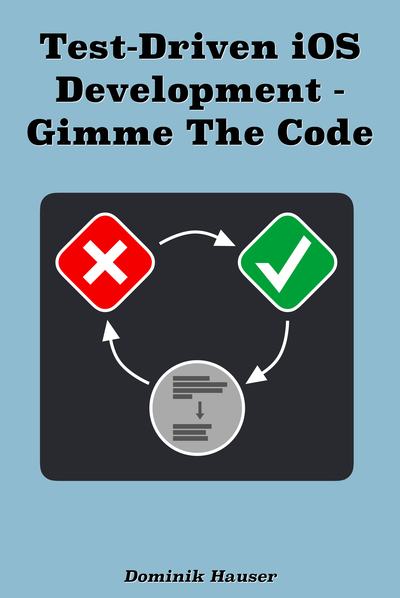
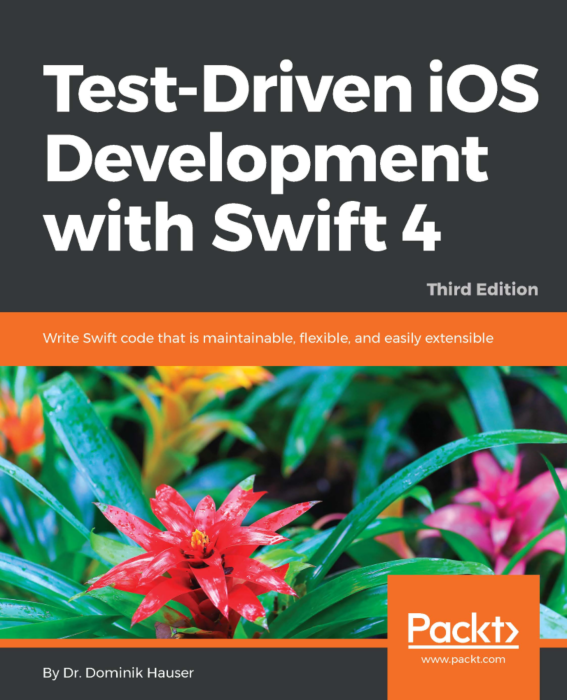
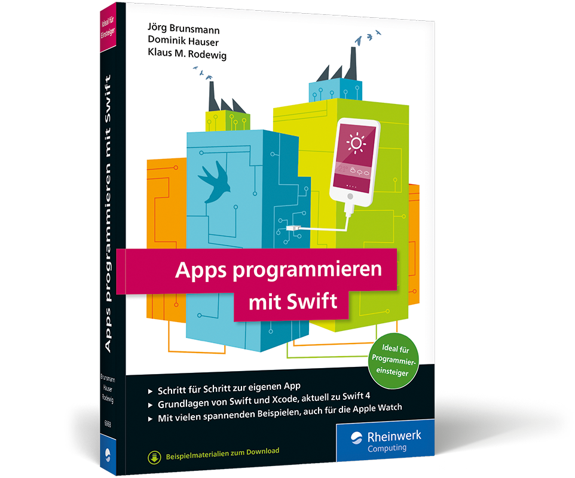

# Books

I write books about iOS development.

## Build Location-Based Projects for iOS

Coding is awesome. So is being outside. With location-based iOS apps, you can combine the two for an enhanced outdoor experience. Use Swift to create your own apps that use GPS data, read sensor data from your iPhone, draw on maps, automate with geofences, and store augmented reality world maps. You’ll have a great time without even noticing that you’re learning. And even better, each of the projects is designed to be extended and eventually submitted to the App Store. Explore, share, and have fun.

<iframe width="560" height="315" src="https://www.youtube.com/embed/f0R7njb4l-Q" frameborder="0" allow="accelerometer; autoplay; encrypted-media; gyroscope; picture-in-picture" allowfullscreen></iframe>

[Get it from Pragmatic Programmers](https://pragprog.com/titles/dhios/)

## Other books

  

    <h3>Test-Driven iOS Development - Gimme The Code</h3>
    
    <a href="https://leanpub.com/tdd_ios_gimme_the_code">Get it on Leanpub</a>
  

  
  

    <h3>Test-Driven iOS Development</h3>
    
    
Don't buy it. It's outdated.

  

  
  

    <h3>Apps programmieren mit Swift</h3>
    
  

