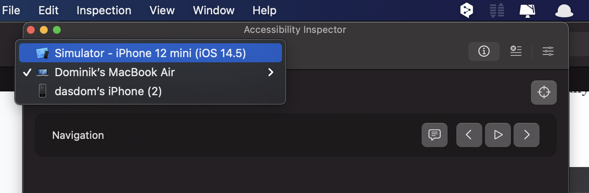
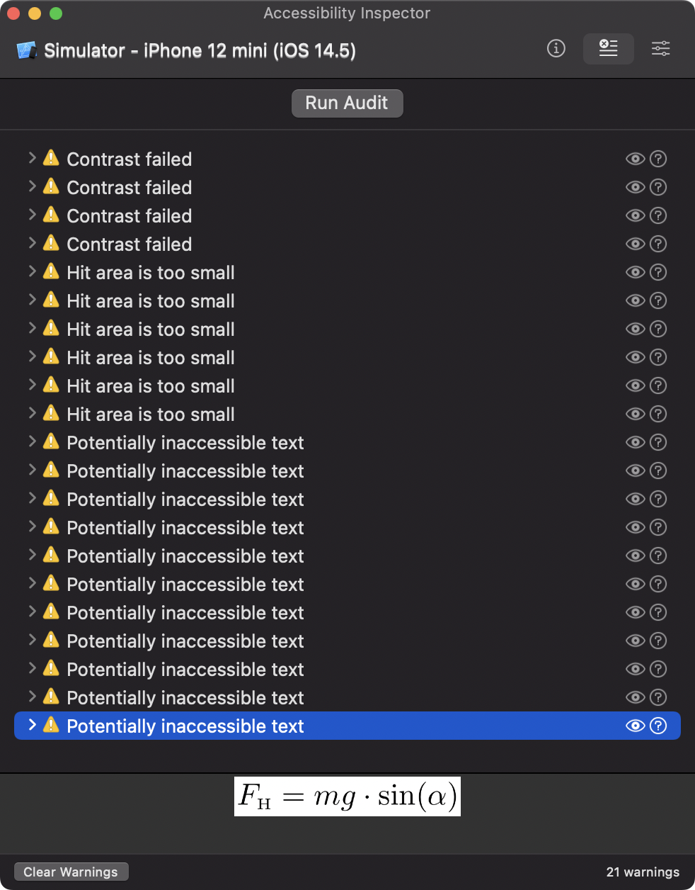
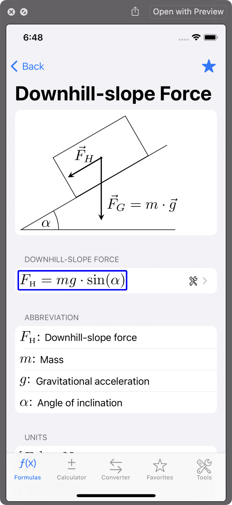

# The Accessibility Inspector

## Accessibility

iOS itself is quite accessible for people with different kind of disabilities.
The most prominent accessibility features in iOS are:

- Dynamic Type: Users can change the size and weight of text in apps.
- Increase Contrast: User can increase the overall contrast of elements in the user interface.
- Reduce Motion: Users can reduce the amount of animations.
- Smart Invert: Users can invert the colours of the user interface.
- VoiceOver: Users can activate the build in screen reader. The standard elements are already accessible by VoiceOver. Developers have to add accessibility labels and hints for custom elements of for images.

To learn more about how to make your apps accessible for all users, start with the relevant WWDC videos:

[ WWDC videos about accessibility](https://developer.apple.com/search/?q=accessibility&type=Videos)

## Build for Accessibility

First of all: Think about accessibility right from the beginning.
Make it a habit to ask already in the design process how the app will be made accessible for all users.
Tell the designers that it’s considered bad design on iOS to use fixed font sizes.
Supporting dynamic type should be considered the minimum for an app.
(Unfortunately you will hear the question “But how many users will that effect?”.
Asking that question is wrong.
But nevertheless, here is an answer: This can effect everyone.
A friend of mine once had an eyes treatment and could not see properly for a few weeks.
He could still use apps that supported dynamic type.)

This post is not about how to make an app accessible.
There are plenty of resources in the internet about that.
I’m sure you will find the perfect blog post for you.
This issue is about how Xcode can help you making your app accessible for all users.

## Accessibility Inspector

Xcode comes with the app Accessibility Inspector.
You can open the app from the Xcode menu in Xcode in the “Open Developer Tool” section.

If it doesn’t work: Sometimes the main window of the Accessibility Inspector does not open.
Even quitting and reopening the Accessibility Inspector does not help.
What helps in these situations for me is the following.

1. Select ‘Window / Show Color Contrast Calculator’
2. Quit the Color Contrast Calculator by clicking closing the window.
3. Open the Accessibility Inspector again.

In the toolbar at the top of the window you can choose the target you want to investigate. (I’m an iOS developer so all my examples are about iOS development. But I guess this works equally well for Mac apps.)

### Audit

First you should switch to the Audit section my clicking the audit button.
Unfortunately there is no shortcut for that action.
The button ‘Run Audit’ checks the current screen of the running app for potential accessibility problems.
For an app I’m working on right now this looks like this.

(I know, I have to work on the accessibility of that app.)
When you select a reported issue, the Accessibility Inspector shows you a preview of that element at the bottom of the window.
In this example, the formula is provided as pdf image without an accessibility label.
VoiceOver users would not ‘see’ this element.
VoiceOver ignores it all together.

When you click the eye button on the right, the Accessibility Inspector shows a screenshot of that view and marks the problematic element.

### Inspection

The left button shows the Inspection section.
On the top right is the inspection point button.
When you activate that button, you can hover over the user interface of your app and inspect what VoiceOver can figure out about the elements in the user interface.

If you additionally select the speech bubble button, the element is read out like VoiceOver will do.
This way you can figure out if all the elements in the user interface are accessible by all users.

But there is more.
Using the string next to ‘Label’ in the Basic section, you can write UI tests to figure out if your app works as expected.
Or you can use UI tests to automatically create the App Store screenshots before you submit a new version.

## Color Contrast Calculator

With ‘Window / Show Color Contrast Calculator’ you can open a tool that helps to figure out if the contrast between the foreground and the background elements is OK.
This is not limited to app development.
You should also use it when you create websites of prepare talk at conferences.

The tool is very simple.
You provide a background and a foreground color and you and it tell you if the contrast is OK for all font sizes.

