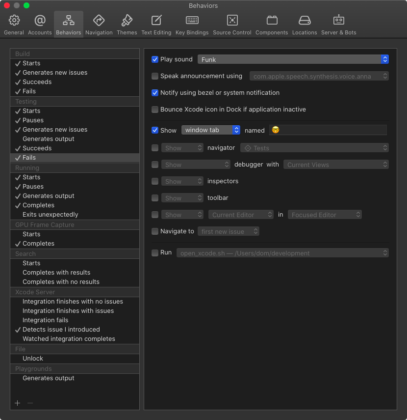
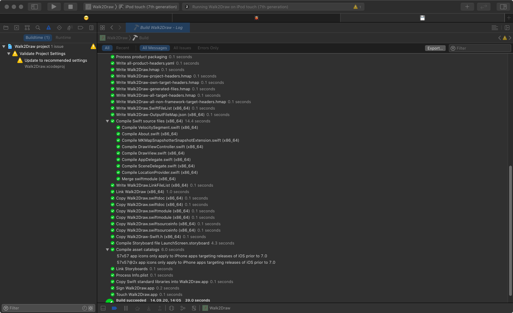

# Using Xcode Behaviors

During development, we developers have to wear different hats.
Sometimes we are programmers, sometimes we are testers, sometimes we are bug hunters, and sometimes we are archaeologist searching for ancient bugs.
Xcode has features for all these roles and Xcode Behaviors can help to automatically switch between these features.

You can find Xcode Behaviors in the Xcode menu at Xcode / Behaviors / Edit Behaviors.

On the left side you see the different contexts Xcode Behaviors can manage:



Within these contexts, you can define what Xcode should show or do when certain trigger happen.
For example, when building starts, I switch to the tab called 💾 and I ask Xcode to navigate to the build log.
If this tab doesn't exist, Xcode creates it.

The build log shows what is build at the moment and even prints the time needed for this step.
This is the build log of my Walk2Draw app:



In case the build seems stuck, look at the bottom of the log to figure out which file causes the delay.
Recently I had build times longer than 300 seconds and the build log showed that the asset catalog was the problem.

Speaking of long build times, you can activate a sound for each of the triggers in Xcode Behaviors.
If you tend to switch to Twitter after you started a build, let Xcode notify you that the build is finished.
In the first Swift versions I even set up a script that switches to Tweetbot when building starts and switches back to Xcode when the debugger is ready.
You can execute a script in each trigger at the bottom of the trigger view:


The script I used is quit simple:

```bash
#!/bin/bash

open /Applications/Tweetbot.app
```

If you are visually impaired, you can let Xcode speak the announcements what is happening when a trigger is met.
And you can show and hide navigators and inspectors.

Poke around a bit in the Behavior settings and try every setting.
I don't want to work with Xcode without Behaviors anymore.
They provide me with valuable information during the different stages of the development work.

## Custom Behaviors

You can even define your own custom Behaviors and connect them with a keyboard shortcut.
Unfortunately you can't define your own triggers but this is better than nothing.
I use a custom trigger to create and switch to a tab I use for searching.

You can read more about my use of tabs here: [Using Tabs in Xcode](../using-tabs-in-xcode).

## Conclusion

Behaviors are a great way to switch contexts in Xcode during development.
And they provide you with information you would need to search for yourself otherwise.

Are you using Xcode Behaviors?
What are you using them for?
Let me know on [Twitter](https://twitter.com/dasdom)
