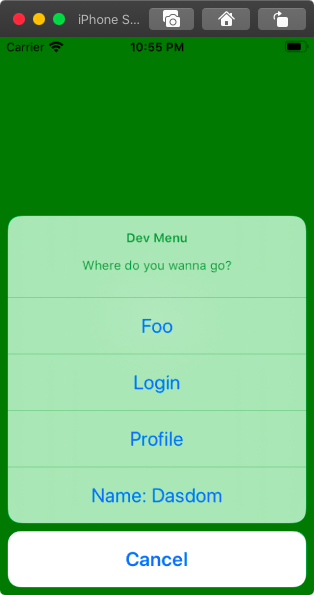

# Adding A Development Menu To Your App

Often during development of an iOS app, I need to navigate to the same part of the app over and over again.
Or I need to simulate events like discovery of iBeacons without having the iBeacons around.
Or I need to test the look of the view with different data.

To make this and much more easy during development I often add a development menu to the app.
When I long press the screen a menu appears that lets me switch to another part of the app or simulate events.



Here is how this can easily be added your you UIKit app.

In this example implementation we want to be able to navigate to an arbitrary view controller and to send notifications via the `NotificationCenter`.
Notifications can be used to trigger arbitrary actions in the apps and they are easy to remove when development is 'finished'.
We define the type of the developer actions in the developer menu using an enum:

## Developer Menu Item

```swift
enum DevActionType {
  case viewController
  case notification
}
```

The structure holding the information about the developer menu item looks like this:

```swift
struct DevAction {
  let name: String
  let identifier: String
  let type: DevActionType
  var userInfo: [AnyHashable : Any]?
  
  init(name: String,
       identifier: String,
       type: DevActionType = .viewController,
       userInfo: [AnyHashable : Any]? = nil) {
    
    self.name = name
    self.identifier = identifier
    self.type = type
    self.userInfo = userInfo
  }
}
```

The developer action consists of a name to be shown in the user interface, an identifier to define the action, a type, and an optional user info to be used in notifications.
Next we need a method that we can call when we want to invoke the action.
I think 'trigger' is a good name for this method.
We have to pass in the window of the app to be able to replace the root view controller:

```swift
func trigger(window: UIWindow? = nil) {
  switch type {
    case .viewController:
      // instantiate view controller and set as root
      let storyboard = UIStoryboard(name: "Main", bundle: nil)
      let viewController = storyboard.instantiateViewController(withIdentifier: identifier)
      window?.rootViewController = viewController

    case .notification:
      // post notification with identifier as name
      let notificationName = Notification.Name(rawValue: identifier)
      NotificationCenter.default.post(name: notificationName,
                                      object: self,
                                      userInfo: userInfo)
  }
}
```

If the type of the action is `.viewController`, we instantiate an instance from the storyboard and set it as the root view controller of the window.
If the type of the action is `.notification`, we post a notification using the identifier as the notification name and the user info.

With a structure for the developer action, we can setup the user interface for the developer menu.
In `SceneDelegate.swift` we add the following extension:

```swift
extension SceneDelegate {
  func setupDevMenu() {
    let devActions = [
      DevAction(name: "Foo", identifier: "FooViewController"),
      DevAction(name: "Login", identifier: "LoginViewController"),
      DevAction(name: "Profile", identifier: "ProfileViewController"),
      DevAction(name: "Name: Dasdom",
                identifier: "changeName",
                type: .notification,
                userInfo: ["name": "dasdom"])
    ]
    
    let sheet = UIAlertController(title: "Dev Menu",
                                  message: "Where do you wanna go?",
                                  preferredStyle: .actionSheet)
    
    for devAction in devActions {
      let action = UIAlertAction(title: devAction.name, style: .default) { action in
        devAction.trigger(window: self.window)
      }
      sheet.addAction(action)
    }
    
    sheet.addAction(UIAlertAction(title: "Cancel", style: .cancel, handler: nil))
    
    window?.rootViewController?.present(sheet, animated: true, completion: nil)
  }
}
```

With this extension we add a method to be called when we want to present the developer menu.
In the method we define the developer actions.
Next we define a `UIAlertController` sheet using the developer actions as actions.
The action to be executed by the `UIAlertController` when we select a developer action just calls the trigger method of the developer action.
We use the root view controller of the window to present the sheet in the user interface.

In our example the developer menu consists of four actions.
Three to present view controllers and one to post a notification.

## Presenting The Developer Menu

The final piece of the puzzle is to present the developer menu in the user interface.
In my [book](https://pragprog.com/titles/dhios/) I show how to use a special shake of the device to trigger a log screen.
In this example we use a long press gesture recognizer to trigger the developer menu.

Fist we add a method that we use as an action for the gesture recognizer.
A good place to define this method is the extension of `SceneDelegate` defined earlier.

```swift
@objc func showDevMenu(_ sender: UIGestureRecognizer) {
  setupDevMenu()
}
```

Next we add the gesture recognizer to the window in `scene(_:willConnectTo:options:)` of the `SceneDelegate`:

```swift
#if DEBUG
let longPressRecognizer = UILongPressGestureRecognizer(target: self, action: #selector(showDevMenu(_:)))
longPressRecognizer.minimumPressDuration = 2
window?.addGestureRecognizer(longPressRecognizer)
#endif
```

It's a good idea to only add the gesture recognizer in DEBUG builds.

## Conclusion

In some apps a developer menu can be a real time safer, especially when you have to iterate over one feature or a certain part of the user interface.
It is quite easy to add such a developer menu in a way that it's safe and it doesn't affect the rest of the app.
We can use notifications to trigger events or to add demo data and wrap this code in `#if DEBUG` statements.

What do you think about this approach?
Are you using something similar?
How do you deal with situations where you have to reach a screen way down in the navigation stack over and over again during development?
Let me know on [Twitter](https://twitter.com/dasdom).
