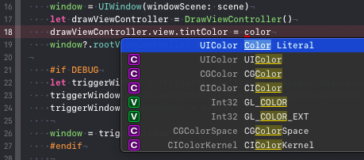
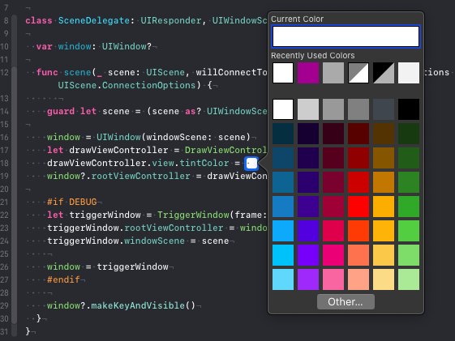
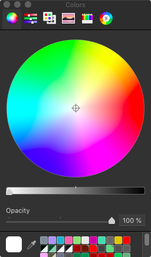
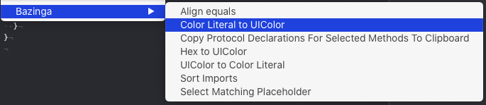
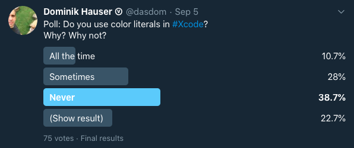
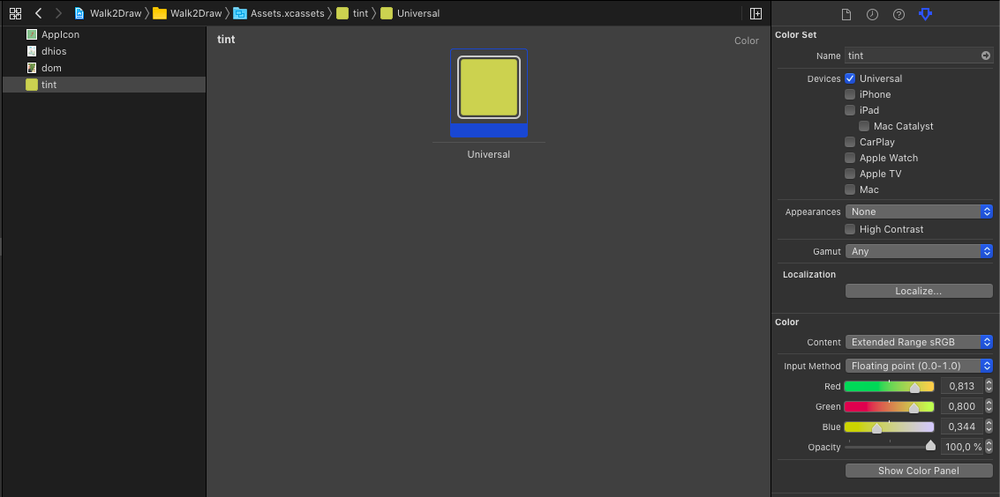
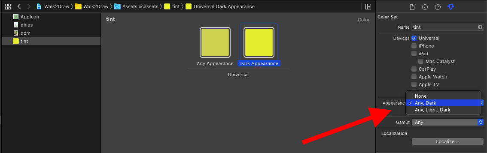
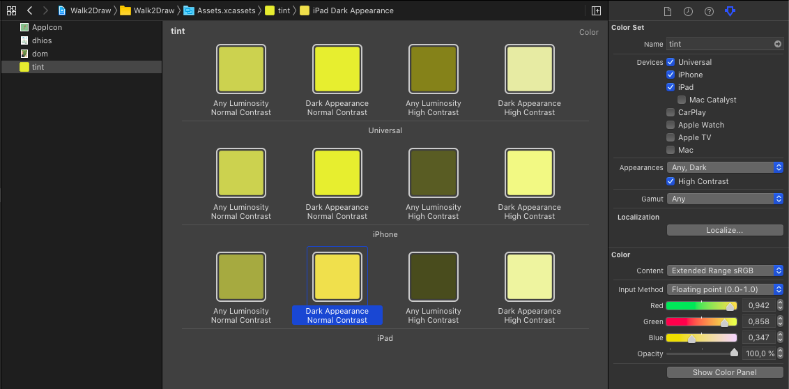
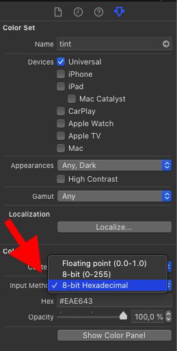

# Colors In Xcode

Xcode provides several ways to deal with colors for our projects.
Let's see what options we have as developers.

## Color Literals

Color literals are a feature of Xcode that lets you define the color in a small rectangular box like this:



The first suggestion in the auto completion by Xcode lets you add a color literal at the cursor position.
Subsequently Xcode shows a small square with the preview of that color:



If you have worked with colors in Xcode before, this looks a bit strange as it differs from the system color selector you see usually:



I think the reason for this is that the color picker you get when using a color literal originated in the Swift Playground app on the iPad.
The iPad didn't have a system color picker back then so Apple implemented a new on and reused in in Xcode on the Mac.
(Please let me know if there is another reason for this.)

You get the system color picker when you click the Other button at the bottom of the picker.

After you have selected a color, the color literal square changes to that color.
But what if you have to switch to common UIColor init because of coding guidelines or your Android colleagues need to know the values of the color to use it in the Android version?
An easy trick to see the values is to comment out the line with the color literal:

```swift
//    drawViewController.view.tintColor = #colorLiteral(red: 0.9529411793, green: 0.6862745285, blue: 0.1333333403, alpha: 1)
```

The color literal is defined using `#colorLiteral(red:green:blue:alpha:)`.
This means you can change the color literal into the definition of a `UIColor` by replacing `#colorLiteral` with `UIColor`.
As this can be annoying if you have several color literals you need to change, I added a feature to my Xcode extension [Bazinga](https://apps.apple.com/de/app/bazinga-for-xcode/id1503241323?l=en&mt=12):



(If you don't have Bazinga yet but liked to use it, let me know on [Twitter](https://twitter.com/dasdom) and I'll send you a promo code.)
As you can see in the screenshot, Bazinga can also translate UIColor definitions into color literals.

I think, color literals are seldom used.
Here is a [poll on Twitter](https://twitter.com/dasdom/status/1302151976520757249?s=20) but this only represents the small group of iOS developers who happen to follow me on Twitter:



## Code

Of course you can define a color in code since like forever:

```swift
let red = UIColor.red

let tint: UIColor = .brown

let backgroundColor = UIColor(hue: 0.32, saturation: 0.84, brightness: 0.9, alpha: 1)

let buttonColor = UIColor(red: 0.1, green: 0.0, blue: 0.5, alpha: 1)

let gray = UIColor(white: 0.96, alpha: 1)
```

## Color Sets

With iOS 11 Apple introduced color sets to iOS development.
You can add a color set by clicking the plus button at the bottom of the asset catalog of your project.
To change the color of the color set, select the color and open the attributes inspector:



As all apps should support dark mode, you can add a different color in the color set for dark mode my selecting Any, Dark for Appearance in the attributes inspector:



You can even add different colors for iPad and iPhone, or for when the user has activated the high contrast accessibility feature in their device.



And you can even define colors using hex values by selecting "8-bit Hexadecimal" for the Input Method in the attributes inspector:



To use the color in your code, initialize a `UIColor` with the initializer `init(named:)` like this:

```swift
drawViewController.view.tintColor = UIColor(named: "tint")
```

## Conclusion

You should always use color sets when possible as they allow to easily support different kind of appearances depending on the settings and preferences of the user.
They also allow to define colors using hex values which you often get from designers.

Do you have comments, additions or suggestions about this post, let me know on Twitter: [@dasdom](http://twitter.com/dasdom).
