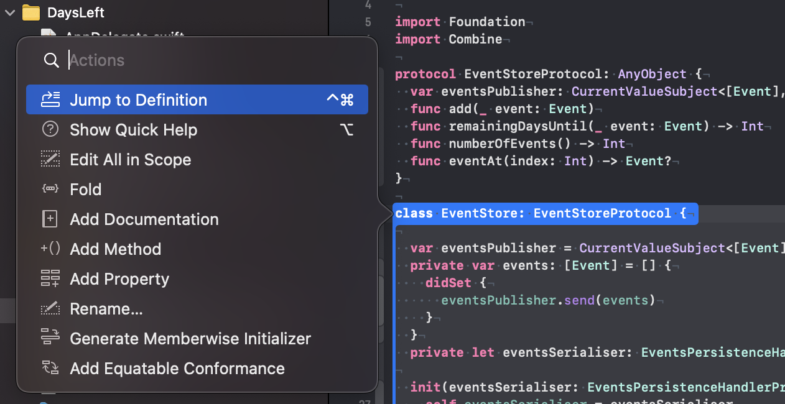

# The Contextual Action Menu

Use the shortcut ⇧⌘A or select the menu item ‘Editor / Show Code Actions’ to open a contextual action menu.
The menu items depend on the position of the cursor.

When you place the cursor in the declaration of a class, the action menu looks like this:

You can find most of these features somewhere else in the menus of Xcode but the action menu is often faster.
After activating the menu with the shortcut ⇧⌘A you can use the arrow keys to select the feature you need.
Or you can start typing to filter the shown features.
This way you need to move you hand to the mouse or the touchpad less often.

In the case of a method, the action menu looks like this:

As I'm often working with code I didn't wrote, finding the callers of a method is extremely useful.
This way I can understand the importance of the method and if I can safely change it to implement new features.

As Apple puts a lot of work into SwiftUI, it's not surprising that the action menu is packed with features when used in a SwiftUI view:

Here is a nice little trick I have seen in a WWDC session video:
If you want to embed some code into a scroll view (or something else that’s not in the context menu), select ‘Embed in HStack’ and change the type to what you need.
