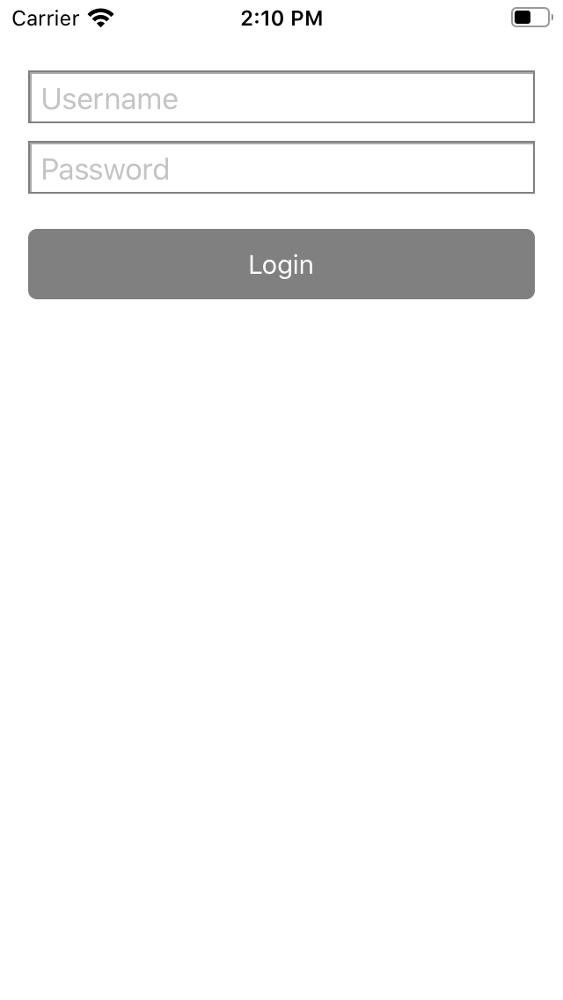

# Don't Put View Code Into Your View Controller

Sometimes I see code that sets up subviews in `viewDidLoad()` of a view controller.
Be a good citizen and don't do that.
If you have to add something to a view, do it in a `UIView` subclass.

Here is how I implement view and controller code when I'm not using Interface Builder.

## The View

Let's build a login view:

```swift
import UIKit

class LoginView: UIView {

  private let usernameTextField: UITextField
  private let passwordTextField: UITextField
  let loginButton: UIButton
  
  override init(frame: CGRect) {
    
    usernameTextField = UITextField()
    usernameTextField.placeholder = NSLocalizedString("Username", comment: "")
    usernameTextField.borderStyle = .bezel
    
    passwordTextField = UITextField(frame: .zero)
    passwordTextField.isSecureTextEntry = true
    passwordTextField.placeholder = NSLocalizedString("Password", comment: "")
    passwordTextField.borderStyle = .bezel
    
    loginButton = UIButton(type: .system)
    loginButton.setTitle(NSLocalizedString("Login", comment: ""), for: .normal)
    loginButton.backgroundColor = .gray
    loginButton.tintColor = .white
    loginButton.layer.cornerRadius = 5
    
    let textFieldStackView = UIStackView(arrangedSubviews: [usernameTextField, passwordTextField])
    textFieldStackView.axis = .vertical
    textFieldStackView.spacing = 10
    textFieldStackView.distribution = .fillEqually
    
    let stackView = UIStackView(arrangedSubviews: [textFieldStackView, loginButton])
    stackView.translatesAutoresizingMaskIntoConstraints = false
    stackView.axis = .vertical
    stackView.spacing = 20
    
    super.init(frame: .zero)
    
    backgroundColor = .white
    
    addSubview(stackView)
    
    let layoutConstraints = [
      stackView.topAnchor.constraint(equalTo: safeAreaLayoutGuide.topAnchor, constant: 20),
      stackView.leadingAnchor.constraint(equalTo: layoutMarginsGuide.leadingAnchor),
      stackView.trailingAnchor.constraint(equalTo: layoutMarginsGuide.trailingAnchor),
      
      usernameTextField.heightAnchor.constraint(equalToConstant: 30),
      
      loginButton.heightAnchor.constraint(equalToConstant: 40),
    ]
    NSLayoutConstraint.activate(layoutConstraints)
  }
  
  required init?(coder: NSCoder) {
    fatalError("init(coder:) has not been implemented")
  }
}

extension LoginView {
  func username() -> String {
    return usernameTextField.text ?? "<empty>"
  }
  
  func password() -> String {
    return passwordTextField.text ?? "<empty>"
  }
}
```

This code defines two text fields and a button and puts it onto the view with the help of `UIStackView`.

## The View Controller

Here comes the view controller:

```swift
import UIKit
import os

class LoginViewController: UIViewController {

  private var contentView: LoginView {
    return view as! LoginView
  }
  
  override func loadView() {
    let contentView = LoginView()
    contentView.loginButton.addTarget(self, action: #selector(login(_:)), for: .touchUpInside)
    view = contentView
  }
}

extension LoginViewController {
  @objc func login(_ sender: UIButton) {
    os_log(.info,
           log: .default,
           "username: %{public}@, password: %{private}@",
           contentView.username(), contentView.password())
  }
}
```

If you build your user interface in code you should override `loadView()`.
Within `loadView()` you need to set the `view` property of the view controller.
In this example we additionally add a target to the login button.

The so defined login screen looks like this:



You can find the sample code on [github](https://github.com/dasdom/AutoLayoutInCodeDemo).
In the sample project you can also find three other possibilities to define the layout and in addition the version using Interface Builder.

Let me know what you think on Twitter: [@dasdom](https://twitter.com/dasdom).
