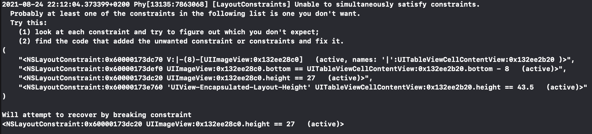
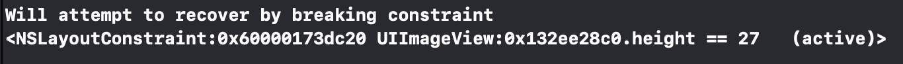
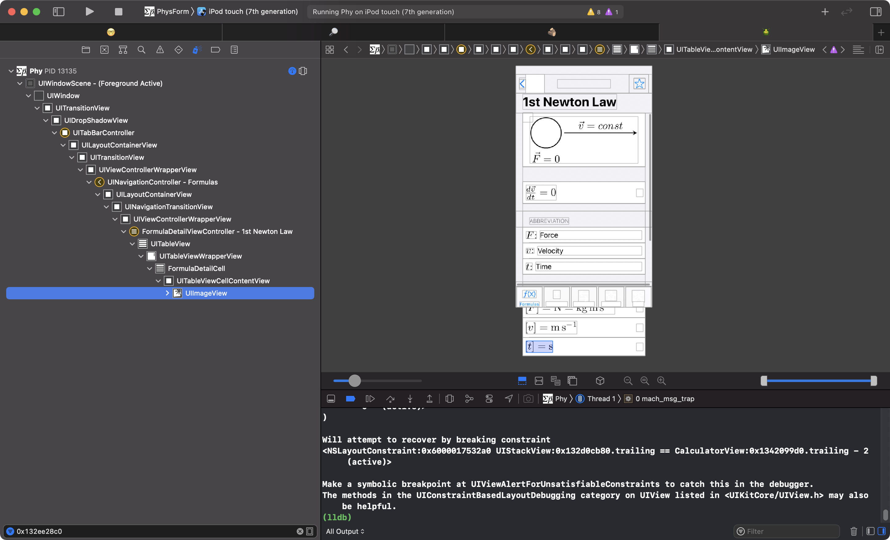

# Find A Problematic View In The View Debugger

## The Problem

I’m quite confident that you have seen a message like this in the debug output (assuming you’ve already used Auto Layout in one of your apps):

You could read all that information and try to figure out, which view has the problematic layout constraint.
But there is an easier way. In the last line Xcode tells you, which constraint it chose to break.

## Find the View
When you see this message, you should copy the id of the view (`0x132ee28c0` in this case) and start the View Debugger in Xcode.
Next, paste the id into the filter field at the lower left and press return.
Xcode shows you exactly which view has the problematic layout constraint.

This should help to figure out what’s going on and how you can fix it.

## Resolve those issues
I read about developers who believe that those issues are normal and can’t be fixed.
This is wrong.
Fix those issues when you see them.

> Don’t live with broken windows.
