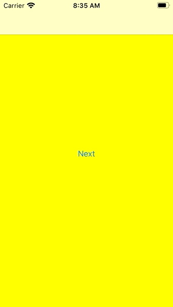

# Building An Expanding Circle Transition Between View Controllers

I love custom transitions between view controllers.
One of the easiest of these transitions is taking an element from the previous view and animating it to its new place in the next view.
For example like shown in this gif:


At the job I had to implement another custom transition where an expanding circular region got punched out of the current view showing the next view beneath it.
It took me a while and several wrong path to finally get it working.

The result looks like this:



(In reality the transition is a bit faster.
I slowed it down for this gif to make the shadow easier to see.)
The first approach we took was to add a circular expanding mask to the next view.

## First Approach: Expanding Mask

Since iOS 8 `UIView` has a `mask` property that can be used to mask the shown portion of the view.
To use this mask in a transition, we first need a `NSObject` subclass that conforms to the protocol `UIViewControllerAnimatedTransitioning`:

```swift
class MaskTransition: NSObject, UIViewControllerAnimatedTransitioning {
  
  let duration: TimeInterval = 1
  
  func transitionDuration(using transitionContext: UIViewControllerContextTransitioning?) -> TimeInterval {
    return duration
  }
  
  func animateTransition(using transitionContext: UIViewControllerContextTransitioning) {
    // To be implemented
  }
}
```

We define the transition animation in the method `animateTransition(using:)`.
Within this method we can access the involved view controllers through the `transitionContext` like this:

```swift
guard let from = transitionContext.viewController(forKey: .from),
  let to = transitionContext.viewController(forKey: .to) else {
    transitionContext.completeTransition(false)
    return
}
```

The transition itself happens in a container view.
We have to add the views that should be visible during the transition to that container view:

```swift
let containerView = transitionContext.containerView

containerView.addSubview(from.view)
containerView.addSubview(to.view)
```

Next we define the start and the end radius of the view mask:

```swift
let fromRadius: CGFloat = 4
let toRadius: CGFloat = containerView.bounds.size.height * 1.2
```

We define the view to be used as the mask view and add it to the view we are transition to:

```swift
let maskView = UIView(frame: CGRect(x: 0, y: 0,
                                    width: fromRadius, height: fromRadius))
maskView.backgroundColor = .white
maskView.center = containerView.center
maskView.layer.cornerRadius = fromRadius/2

to.view.mask = maskView
```

Note that we set the `backgroundColor` of the mask view to `.white` here.
As this view is used as a mask, only the alpha value of that background color is used.
So you could also set the color to any other color as long as its alpha value is `1`.

Finally we can animate the transition like this:

```swift
UIViewPropertyAnimator.runningPropertyAnimator(
  withDuration: duration, delay: 0, options: .curveEaseIn, animations: {
    
    maskView.frame = CGRect(x: 0, y: 0, width: toRadius, height: toRadius)
    maskView.center = containerView.center
    maskView.layer.cornerRadius = toRadius/2
    
}) { position in
  
  to.view.mask = nil
  let complete = !transitionContext.transitionWasCancelled
  transitionContext.completeTransition(complete)
  
}
```

When the animation is finished, we need to tell the transition context that the transition is complete.
Don't forget this step otherwise the transition never finishes and the user interface stays unresponsive.

To use this transition when a view controller gets pushed onto the navigation stack, create a class called `NavigationControllerDelegate` and add the following code:

```swift
class NavigationControllerDelegate: NSObject, UINavigationControllerDelegate {
  
  func navigationController(_ navigationController: UINavigationController,
                            animationControllerFor operation: UINavigationController.Operation, 
                            from fromVC: UIViewController, 
                            to toVC: UIViewController) -> UIViewControllerAnimatedTransitioning? {
    
    return MaskTransition()
  }
}
```

Finally we need to set the delegate to the navigation controller we are using.
You can do that where ever it fits in your code.
As I'm creating the user interface in code, a good place to set the navigation controller delegate is the scene delegate where I create the navigation controller:

```swift
var navigationControllerDelegate = NavigationControllerDelegate()

func scene(_ scene: UIScene,
           willConnectTo session: UISceneSession,
           options connectionOptions: UIScene.ConnectionOptions) {
  
  guard let scene = (scene as? UIWindowScene) else { return }
  
  window = UIWindow(windowScene: scene)
  let navigationController = UINavigationController(rootViewController: ViewController())
  navigationController.delegate = navigationControllerDelegate
  window?.rootViewController = navigationController
  window?.makeKeyAndVisible()
}
```

This transition looks kind of what we try to achieve but one essential part is missing: the shadow.
There should be a shadow indicating that this is a punch out in the current view, revealing the next view underneath it.
I tried everything I could imagine but I didn't manage to add this shadow.
This is not really surprising as we do not punch out anything here.
So to make the transition as required, we have to actually punch out a portion of the view.

(If you don't need the shadow, you can use this transition because it's simpler than the following one.)

## Punch Out With Shadow

First let's recreate the transition we did with the mask view but this time punching out instead of masking.
The start of `animateTransition(using:)` looks the same:

```swift
func animateTransition(using transitionContext: UIViewControllerContextTransitioning) {
  
  guard let from = transitionContext.viewController(forKey: .from),
    let to = transitionContext.viewController(forKey: .to) else {
      transitionContext.completeTransition(false)
      return
  }
  
  let containerView = transitionContext.containerView
  containerView.addSubview(to.view)
  containerView.addSubview(from.view)
  
  let fromWidth: CGFloat = 4
  let toWidth = containerView.bounds.size.height * 1.2
  
  // More code...
}
```

Instead of masking, we define a `UIBezierPath` consisting of a rectangle around the container view and small circular path in the center:

```swift
let center = containerView.center
let fromPath = UIBezierPath(rect: containerView.bounds)
let fromRect = CGRect(x: center.x - fromWidth/2, y: center.y - fromWidth/2, width: fromWidth, height: fromWidth)
let maskFromPath = UIBezierPath(ovalIn: fromRect)
fromPath.append(maskFromPath)
```

In the same way we define a `UIBezierPath` with a larger frame and a much larger circular path:

```swift
let toPath = UIBezierPath(rect: containerView.bounds.insetBy(dx: -40, dy: -40))
let toRect = CGRect(x: center.x - toWidth/2, y: center.y - toWidth/2, width: toWidth, height: toWidth)
let maskToPath = UIBezierPath(ovalIn: toRect)
toPath.append(maskToPath)
```

Next we need two layers; one for the mask and one for the shadow:

```swift
let maskLayer = CAShapeLayer()
maskLayer.frame = containerView.bounds
maskLayer.fillRule = .evenOdd
maskLayer.path = fromPath.cgPath
from.view.layer.mask = maskLayer

let shadowLayer = CAShapeLayer()
shadowLayer.frame = containerView.bounds
shadowLayer.fillRule = .evenOdd
shadowLayer.shadowColor = UIColor.black.cgColor
shadowLayer.shadowOpacity = 1
shadowLayer.shadowRadius = 6
shadowLayer.shadowOffset = .zero
shadowLayer.path = fromPath.cgPath
from.view.superview!.layer.insertSublayer(shadowLayer, below: from.view.layer)
```

We have to use the `.evenOdd` fill rule because other wise the circular path is not punched out.
The mask layer is used as the mask of the layer of the `from.view` like we did in the previous section with the mask view.

The shape layer is inserted in the layer tree underneath the layer of the `from.view`.
It has the same path and also uses the `.evenOdd` fill rule.

`UIViewPropertyAnimator` cannot animate layer properties.
We have to fall back to `CABasicAnimation`:

```swift
CATransaction.begin()
CATransaction.setCompletionBlock {
  maskLayer.removeFromSuperlayer()
  shadowLayer.removeFromSuperlayer()
  
  let complete = !transitionContext.transitionWasCancelled
  transitionContext.completeTransition(complete)
}

maskLayer.path = toPath.cgPath
shadowLayer.path = toPath.cgPath

let animation = CABasicAnimation(keyPath: "path")
animation.fromValue = fromPath.cgPath
animation.toValue = toPath.cgPath
animation.duration = duration
animation.timingFunction = CAMediaTimingFunction(name: .easeIn)

maskLayer.add(animation, forKey: "pathAnimation")
shadowLayer.add(animation, forKey: "pathAnimation")

CATransaction.commit()
```

The `CATransaction` let's us define a completion block that gets executed when the animation has finished.
In the completion block we remove the layers and complete the transition.

That's it.
We can now add a cool punch out circular transition between view controllers.

## The Pop Transition

The code we have written only manages the push transition.
In the pop transition we have to move some code around to make it work.
Here is the complete code also handling the pop transition:

```swift
class MaskTransition: NSObject, UIViewControllerAnimatedTransitioning {
  
  let duration: TimeInterval = 1
  let operation: UINavigationController.Operation
  
  init(operation: UINavigationController.Operation) {
    self.operation = operation
    
    super.init()
  }
  
  func transitionDuration(using transitionContext: UIViewControllerContextTransitioning?) -> TimeInterval {
    return duration
  }
  
  func animateTransition(using transitionContext: UIViewControllerContextTransitioning) {

    guard let from = transitionContext.viewController(forKey: .from),
      let to = transitionContext.viewController(forKey: .to) else {
        transitionContext.completeTransition(false)
        return
    }

    let containerView = transitionContext.containerView
    if operation == .push {
      containerView.addSubview(to.view)
      containerView.addSubview(from.view)
    } else {
      containerView.addSubview(from.view)
      containerView.addSubview(to.view)
    }

    let fromWidth: CGFloat = 4
    let center = containerView.center
    let fromPath = UIBezierPath(rect: containerView.bounds)
    let fromRect = CGRect(x: center.x - fromWidth/2, y: center.y - fromWidth/2, width: fromWidth, height: fromWidth)
    let maskFromPath = UIBezierPath(ovalIn: fromRect)
    fromPath.append(maskFromPath)
    fromPath.usesEvenOddFillRule = true

    let toWidth = containerView.bounds.size.height * 1.2
    let toPath = UIBezierPath(rect: containerView.bounds.insetBy(dx: -40, dy: -40))
    let toRect = CGRect(x: center.x - toWidth/2, y: center.y - toWidth/2, width: toWidth, height: toWidth)
    let maskToPath = UIBezierPath(ovalIn: toRect)
    toPath.append(maskToPath)
    toPath.usesEvenOddFillRule = true

    let maskLayer = CAShapeLayer()
    maskLayer.frame = containerView.bounds
    maskLayer.fillRule = .evenOdd
    if operation == .push {
      maskLayer.path = fromPath.cgPath
      from.view.layer.mask = maskLayer
    } else {
      maskLayer.path = toPath.cgPath
      to.view.layer.mask = maskLayer
    }

    let shadowLayer = CAShapeLayer()
    shadowLayer.frame = containerView.bounds
    shadowLayer.fillRule = .evenOdd
    shadowLayer.shadowColor = UIColor.black.cgColor
    shadowLayer.shadowOpacity = 1
    shadowLayer.shadowRadius = 6
    shadowLayer.shadowOffset = .zero
    if operation == .push {
      shadowLayer.path = fromPath.cgPath
      from.view.superview!.layer.insertSublayer(shadowLayer, below: from.view.layer)
    } else {
      shadowLayer.path = toPath.cgPath
      to.view.superview!.layer.insertSublayer(shadowLayer, below: to.view.layer)
    }

    CATransaction.begin()
    CATransaction.setCompletionBlock {
      maskLayer.removeFromSuperlayer()
      shadowLayer.removeFromSuperlayer()

      let complete = !transitionContext.transitionWasCancelled
      transitionContext.completeTransition(complete)
    }

    if operation == .push {
      maskLayer.path = toPath.cgPath
      shadowLayer.path = toPath.cgPath
    } else {
      maskLayer.path = fromPath.cgPath
      shadowLayer.path = fromPath.cgPath
    }

    let animation = CABasicAnimation(keyPath: "path")
    if operation == .push {
      animation.fromValue = fromPath.cgPath
      animation.toValue = toPath.cgPath
    } else {
      animation.fromValue = toPath.cgPath
      animation.toValue = fromPath.cgPath
    }
    animation.duration = duration
    animation.timingFunction = CAMediaTimingFunction(name: .easeIn)
    maskLayer.add(animation, forKey: "pathAnimation")
    shadowLayer.add(animation, forKey: "pathAnimation")
    CATransaction.commit()

  }
```

To make it work, we need to pass in the operation in the navigation controller delegate:

```swift
class NavigationControllerDelegate: NSObject, UINavigationControllerDelegate {
 
  func navigationController(_ navigationController: UINavigationController,
                            animationControllerFor operation: UINavigationController.Operation,
                            from fromVC: UIViewController,
                            to toVC: UIViewController) -> UIViewControllerAnimatedTransitioning? {
    
    return MaskTransition(operation: operation)
  }
}
```

## Conclusion

Custom transitions between view controllers are not easy.
But when you finally managed to write custom transitions, most of the times they add some cool personality to your apps.

Do you add custom transitions to your apps?
How do they look like?
Did you get feedback from your users about transitions in your app?

Have you an idea how to achieve the same look without using `CALayer`s and `CABasicAnimation`s?
Do you have other comments or suggestions?
Please let me know on Twitter: [@dasdom](https://twitter.com/dasdom)!
