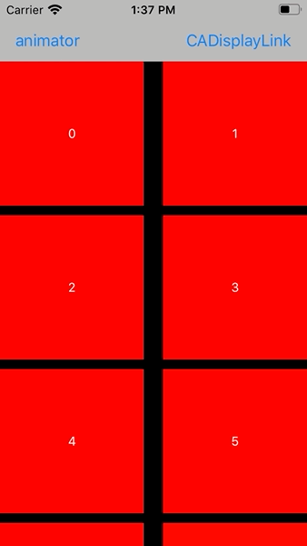
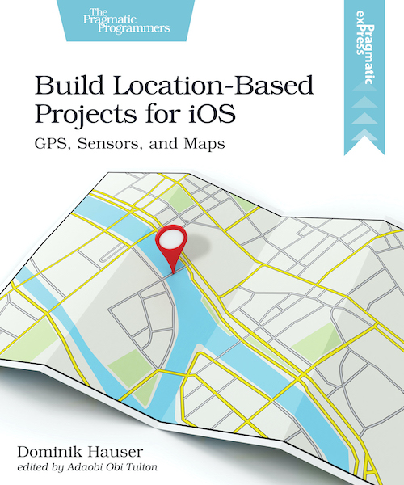

---
2020-09-01 12:00
tags: Animation, UICollectionView, CADisplayLink
---

# Scrolling A Collection View With Costum Duration Using CADisplayLink

Last week I needed to scroll a collection view animated to its end with a define duration.
Should be easy, right?
Just set the content offset of the collection view in an animation block like this:

```swift
UIViewPropertyAnimator.runningPropertyAnimator(withDuration: 1, delay: 0, options: .curveEaseInOut, animations: {
  self.collectionView.contentOffset.y = self.maxOffset
}, completion: nil)
```

The result looks like this:



Oh, that was unexpected.
It does indeed animate the content offset of the collection view but during the animation the cells aren't rendered.
Only the cells visible in the final position are dequeued and setup.

If we add a print message to `collectionView(_:cellForItemAt:)` we can see in the debug output that the data source method is only called for the cells visible after the animation has finished:

```
indexPath.row: 0
indexPath.row: 1
indexPath.row: 2
indexPath.row: 3
indexPath.row: 4
indexPath.row: 5
indexPath.row: 6
indexPath.row: 7
indexPath.row: 992
indexPath.row: 993
indexPath.row: 994
indexPath.row: 995
indexPath.row: 996
indexPath.row: 997
indexPath.row: 998
indexPath.row: 999
```

To get the collection view to render the cells (to call the data source method), we need to implement the animated scrolling ourselves.
We could try to use a timer that is configured to fire 60 times per second and changed the content offset of the collection view in the action of the timer.
The problem is, iOS doesn't guarantee the exact timing of a timer and we would have to figure out the refresh rate of the screen our app is running on.

There is a better solution: CADisplayLink.
CADisplayLink is a class that is connected to the refresh mechanism of the screen.
It calls a method we define after a frame finished rendering and we can setup the content of the screen accordingly.
And it's quite easy to use.

## Using CADisplayLink

First we need to setup the display link:

```swift
@objc func scrollDownDisplayLink() {
  if displayLink == nil {
    displayLink = CADisplayLink(target: self, selector: #selector(updateScrollPosition))
    displayLink?.add(to: .current, forMode: .default)
  }
}
```

In this code we tell the display link that it should call the method `updateScrollPosition()` after each screen rendering.
The method should calculate the new scroll position based on the animation curve and the elapsed time.
This is a possible implementation:

```swift
@objc func updateScrollPosition() {
  guard let displayLink = displayLink else {
    return
  }
  
  // get timestamp at start of animation
  if startTimestamp < 1 {
    startTimestamp = displayLink.timestamp
    startOffset = collectionView.contentOffset.y
    return
  }
  
  // calculate fraction of animation; 0: start; 1: end
  let fraction = (displayLink.targetTimestamp - startTimestamp) / duration
  if fraction > 1 || previousFraction > fraction {
    // animation is finished
    displayLink.invalidate()
    self.displayLink = nil
    startTimestamp = 0
    previousFraction = 0
    // scroll to final point just to make sure
    collectionView.setContentOffset(CGPoint(x: 0, y: maxOffset), animated: false)
  } else {
    // calculate offset for this frame of the animation
    let offset = (maxOffset - startOffset) * CGFloat(easeInOut(for: fraction)) + startOffset
    collectionView.contentOffset.y = offset
    previousFraction = fraction
  }
}

// https://stackoverflow.com/a/25730573/498796
private func easeInOut(for fraction: Double) -> Double {
  return fraction * fraction * (3.0 - 2.0 * fraction)
}
```

In this code, we first figure out if the start time stamp is already set.
We need this to calculate the fraction of the animation for the next screen update.
Next we calculate this fraction (formula from [here](https://stackoverflow.com/a/25730573/498796).
If the result is larger than 1 or smaller than the previous fraction, the animation is finished and we invalidate and clean up the display link.

Otherwise we calculate the new offset using the method `easeInOut(for:)`.
This method takes the time fraction of the animation as a parameter and returns the fraction of the animation.
This is how animation curves work.
For any given fraction of time of the animation there is a fraction of animation value (in this case scroll offset).

Using this code the animation looks like this:


## Conclusion

It's a bit unexpected that there is no easy build-in way to scroll a collection view to a desired offset.
Maybe there is and I wasn't patient enough to find it.
If you know a better way to do this, please let me know.

Fortunately `CADisplayLink` is easy to use.

If you have comments or remarks about this post, let me know on Twitter: [@dasdom](https://twitter.com/dasdom)

## My Book

Are you a beginner in iOS and want to learn something about GPS, maps and sensors while having fun?
Check out [my new book](https://pragprog.com/titles/dhios/build-location-based-projects-for-ios/):


