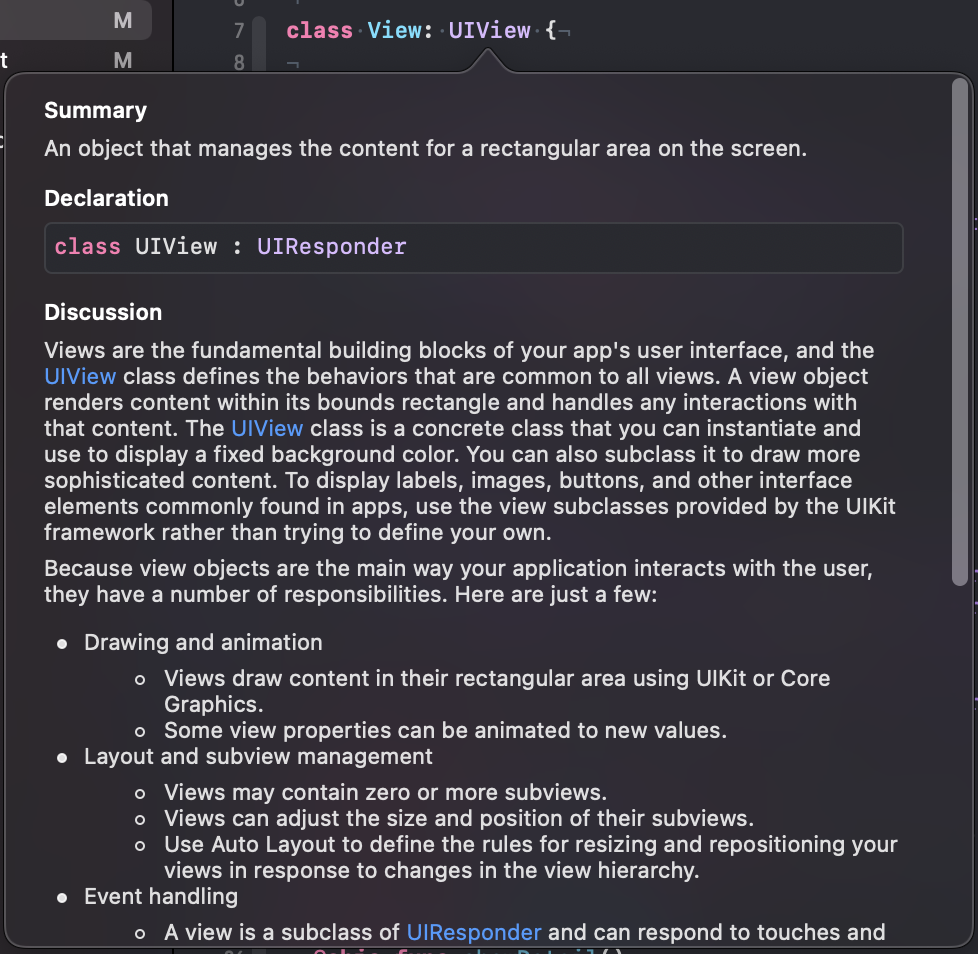

# #selector And The Responder Chain

I don’t know about you, but I tend to forget that there is a responder chain in iOS.
This post is to remind myself (and you) that the responder chain exists and that we can use it to react to button events.

## The Responder Chain

In iOS, events (for example touch events) are delivered using the responder chain.
The responder chain consists of responder objects.
If you have a look at the documentation, you may have noticed that UIView and UIViewController are responder objects.
This means they inherit from UIResponder:



When the user taps a view in the view hierarchy, iOS uses hit testing to figure out which responder object should get the touch event first.
The process starts at the lowest level, the window.
Then is propagates up the view hierarchy and checks for each view if the touch happened within its bounds.
The last view in that process that got hit, receives the touch event first.
If that view does not respond to the touch event, the event is passed to the next responder in the responder chain.
When a view tells iOS that it did not get hit, the subviews of that view aren’t checked.

This has an interesting consequence. When a button is outside of the bounds of its superview but visible because clipsToBounds of the superview is set to false, it does not receive any touch events.
So, when ever a button doesn’t work, remember to check if it is in the bound of its superview.

## Target-Action

The target-action mechanism can be set up that is also uses the responder chain by setting the target to nil.
Then iOS asks the first responder if it handles the action.
If not the first responder passes the action to the [next](https://developer.apple.com/documentation/uikit/uiresponder/1621099-next) responder.

Since Swift 2.2 you set up the action of a button using `#selector()`.
The compiler checks if the method within the parentheses is implemented.
But when using the responder chain, you can't tell if some class in the chain implements this method.

Here is how you can use `#selector()` and still send the events to the responder chain.

First we need a protocol for the method that should be executed.

```swift
@objc protocol DetailShowable {
  @objc func showDetail()
}
```

Then we can add an extension to `Selector` as described in [this awesome post](https://medium.com/swift-programming/swift-selector-syntax-sugar-81c8a8b10df3#.6gteb7p1s) by [Andyy Hope](https://twitter.com/AndyyHope) that looks like this:

```swift
private extension Selector {
  static let showDetail = #selector(DetailShowable.showDetail)
}
```

Adding the action to the responder chain is then as easy as this:

```swift
button.addTarget(nil,
                 action: .showDetail,
                 for: .touchUpInside)
```

Then some responder object in the responder chain needs to conform to the `DetailShowable` protocol.

You can find the code on [Github](https://github.com/dasdom/SelectorSyntaxSugar).
