# Sketch Notes At UIKonf 2017

I attended UIKonf (iOS developer conference in Berlin) this week. Great conference. I have been at UIKonf in 2014 but this time it was so much better for me because I talked to so many people. It's not that the people have been more open this time.

It's more like this time I met many people I knew from Twitter and Slack channels. In addition I have been grown more into the community since 2014.

Something else was different this time. For the first time I started to do sketch notes during the talks. I'm not good with sketch notes yet meaning that I cannot draw. As a result often I had to write words instead of drawing images. Nevertheless doing sketch notes helped me to stay focused and concentrated. And I still remember what was presented in most of the talks.

After each talk I published the sketch note to twitter and shared it with the speaker(s). This way the speaker got feedback about what key points I digested.
<!--more-->
I used Notablility on my iPad. During the talks I edited the notes if necessary, for example when I first misunderstood the point or when the visual structure could be improved by moving stuff around. But I didn't change anything after the talk was over.

And here are the notes together with the links to the videos. Have fun!

## [YOLO Releases Considered Harmful](https://youtu.be/7DIVDzHtL2c)
[Cate Huston](https://twitter.com/catehstn)

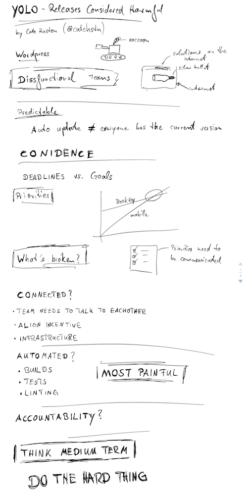

---

## [Review All The Thinks!](https://youtu.be/KRVdrwxIszU)
[Marciej Piotrowski](https://twitter.com/paciej00)

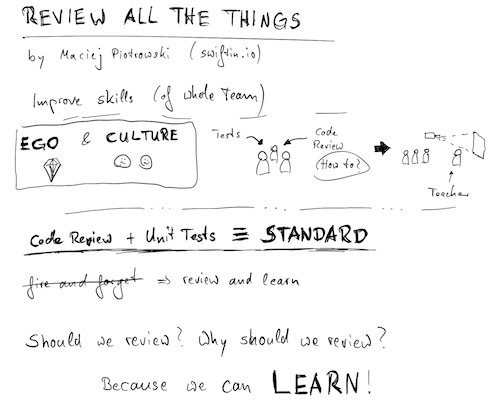

---

## [High Performance App Architecture](https://youtu.be/kHG_zw75SjE)
[Marcel Weiher](https://twitter.com/mpweiher)

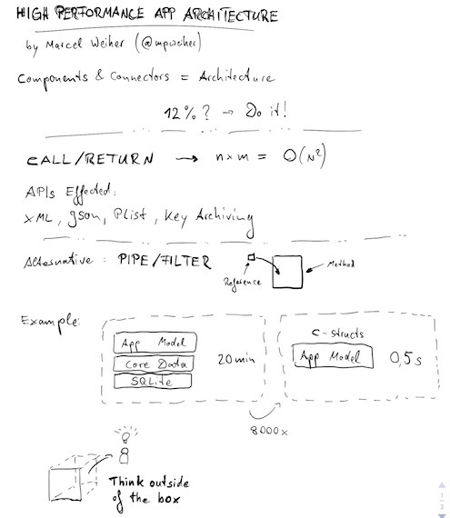

---

## [Reactive Programming From Scratch](https://youtu.be/sEQiMCiMgpc)
[Thomas Visser](https://mobile.twitter.com/thomvis)

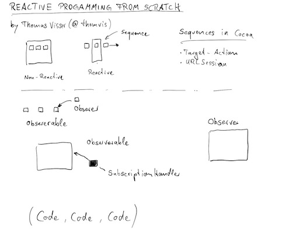

---

## [Good Typography, Better Apps](https://youtu.be/YM2Nj691PMo)
[Frank Rausch](https://mobile.twitter.com/frankrausch)

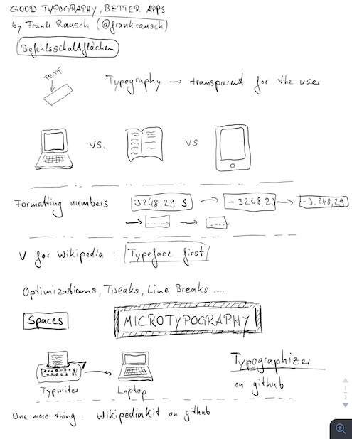

---

## Unsophisticated Software Development
Andreas Oetjen

Unfortunately I stopped doing sketch notes during the talk because I didn't get the key points.

---

## An iOS Developer's take on React Native
[Harry Tormey](https://twitter.com/htormey)

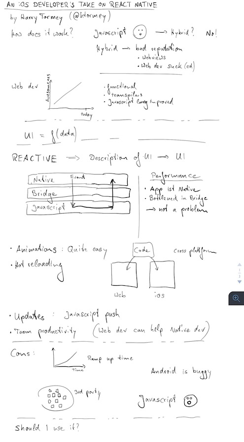

---

## [Learning From Our Elders](https://youtu.be/c3Kg3c8vqsc)
[Rob Napier](https://mobile.twitter.com/cocoaphony)

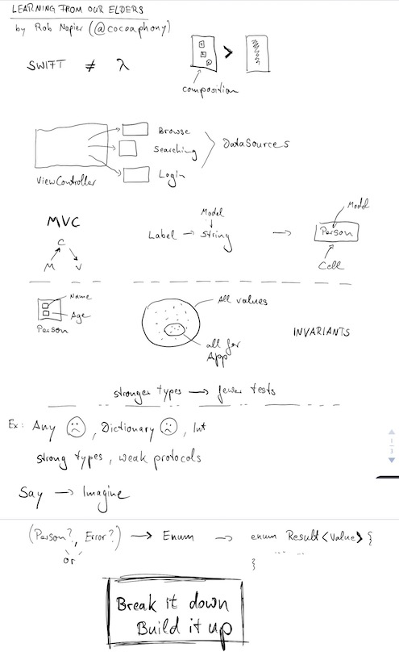

---

## [Re:Programming Language](https://youtu.be/naAR9qxVOxc)
[TJ Usiyan](https://mobile.twitter.com/griotspeak)

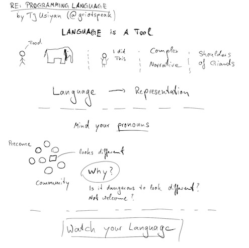

---

## [Implementing Compassion](https://youtu.be/8YgN9XWE_dY)
[Gwen Weston](https://mobile.twitter.com/purpleyay)

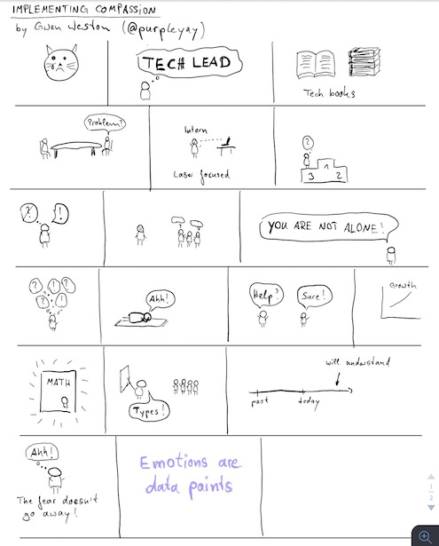

---

## [Move fast and keep your code quality](https://youtu.be/gsLoUN7jyNs)
[Francisco Diaz](https://mobile.twitter.com/fco_diaz)

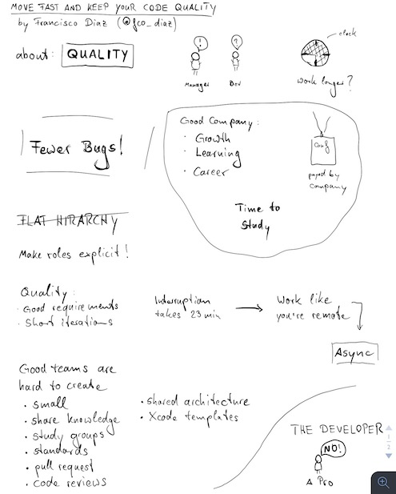

---

## [Strong typing from the server to the UI with GraphQL](https://youtu.be/MGHwJ-dH2Os)
[Martijn Walraven](https://mobile.twitter.com/martijnwalraven)

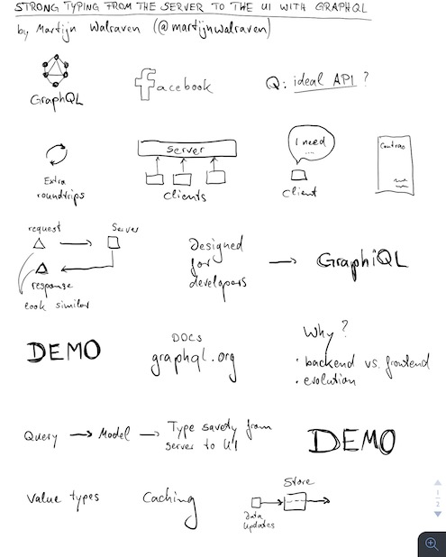

---

## [Code Generation in Swift](https://youtu.be/x_viZfIe8tY)
[Olivier Halligon](https://mobile.twitter.com/aligatr)

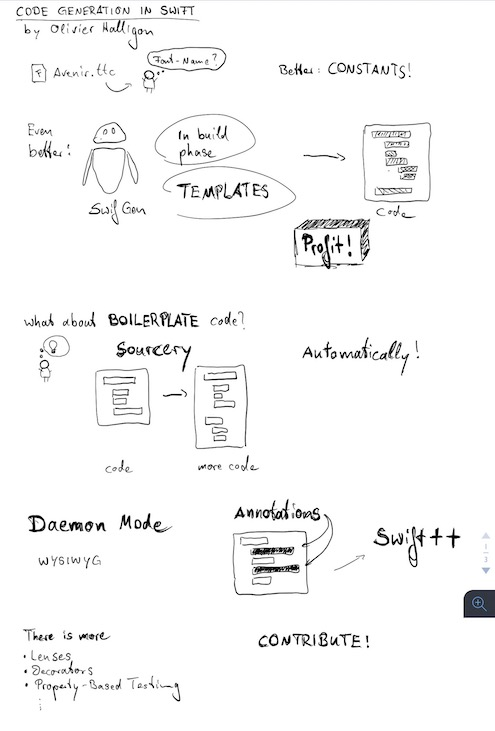

---

## [Developing Empathy](https://youtu.be/PUJxodCM6Sg)
[Sarah E Olson](https://mobile.twitter.com/saraheolson)

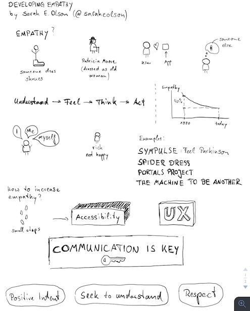

---

## [Anything you can do, I can do better](https://youtu.be/_DuGaAkQSnM)
[Brandon Williams](https://mobile.twitter.com/mbrandonw) & [Lisa Luo](https://mobile.twitter.com/luoser)

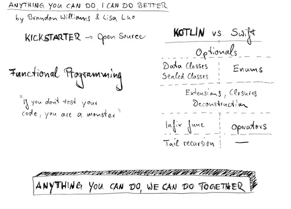

---

## [Auto Layout - From Trailing to Leading](https://youtu.be/xjArhdrqAn8)
[Mischa Hildebrand](https://mobile.twitter.com/DerHildebrand)

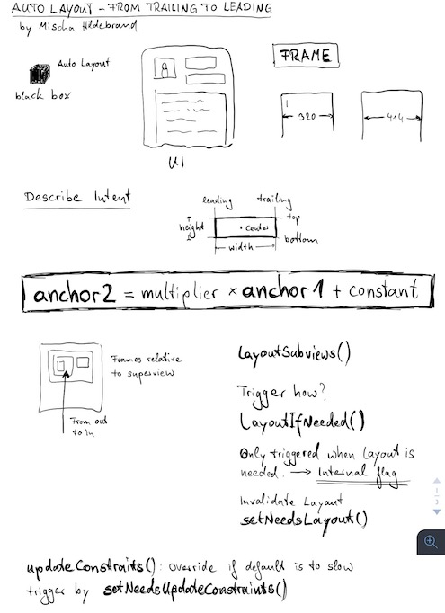

---

## [Accessibility - iOS for All](https://youtu.be/G01Ac5njNSs)
[Sommer Panage](https://twitter.com/sommer)

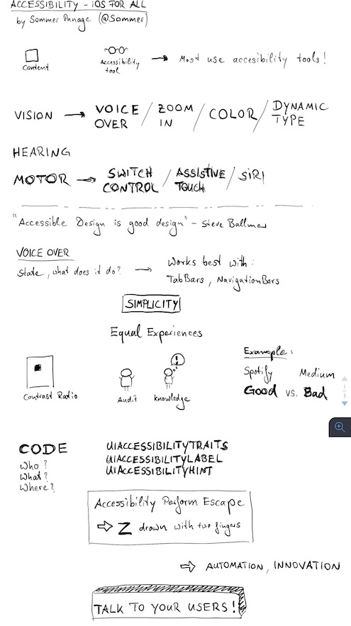

---
