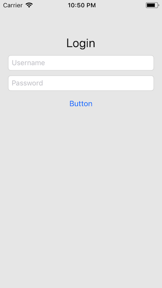
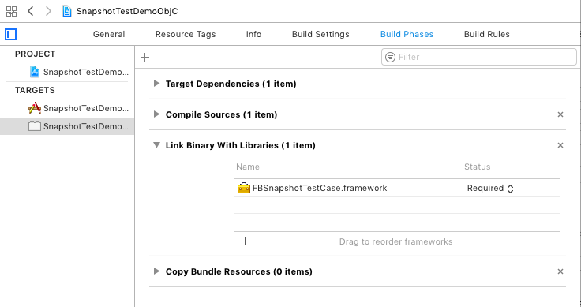
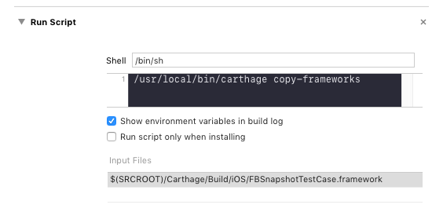
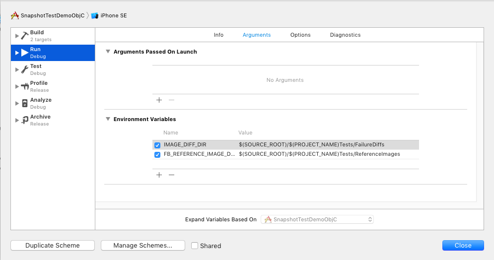

# Snapshot tests with iOSSnapshotTestCase

Sometimes you need to add automatic tests for the UI of your app. There are several different approaches to achieve this.

In the test you could get the elements of the screen and assert if all the frames are as you expect. Depending on the UI you want to test, this can be a lot of work.

Or you could use UI tests provided by Xcode. But those are slow and in my experience sometimes they just stop working.

There is a better alternative. Uber has an open source component called [ios-snapshot-test-case](https://github.com/uber/ios-snapshot-test-case/). With this you can create snapshot tests. A snapshot test compares the UI of a view with a snapshot of how the view should look like. Let’s see how this works.

The UI I would like to test looks like this:



The UI consists of a label, two text fields and a button.

## Installing iOSSnapshotTestCase using Carthage

I’m a Carthage person. So I will show you how to use Carthage to install `iOSSnapshotTestCase` in the test target and use it to add a snapshot test for a simple login screen.

Create a Cartfile that looks like this:

```bash
github "uber/ios-snapshot-test-case"
```

Then ask Carthage to create the dynamic framework with the command

```bash
carthage update --platform iOS
```

Carthage will fetch the source code from github and build the framework. When Carthage is finished, drag the framework from the `Carthage/Bild/iOS` folder to **Link Binary with Libraries** build phase of you test target:



As you can see, the name of the framework is `FBSnapshotTestCase` and not iOSSnapshotTestCase. Facebook was the original author of this framework and Uber hasn't manage to change the name yet.

Next, add a new run script build phase to the test target. Put in the command

```bash
/usr/local/bin/carthage copy-frameworks
```

and add the Input File `$(SRCROOT)/Carthage/Build/iOS/FBSnapshotTestCase.framework`. In Xcode it should look like this:



# Configure FBSnapshotTestCase

Next you need to configure the directories where the snapshots should be put. You can also tell `FBSnapshotTestCase` to create a diff image whenever a snapshot test fails. This means, when a test fails, an image is created that shows the difference between the expected UI and the UI that made the test fail. That way you can figure out what changed in the UI.

Open the scheme you use of the test and add the following environment variables:

```bash
IMAGE_DIFF_DIR: $(SOURCE_ROOT)/$(PROJECT_NAME)Tests/FailureDiffs
FB_REFERENCE_IMAGE_DIR: $(SOURCE_ROOT)/$(PROJECT_NAME)Tests/ReferenceImages
```

In Xcode this looks like this:



# Create the snapshot

To create a snapshot test, add a subclass of `FBSnapshotTestCase` to your test target and add the following import statement:

```objc
#import <FBSnapshotTestCase/FBSnapshotTestCase.h>
```

Next add the test method:

```objc
- (void)test_loginSnapshot {
    UIStoryboard *storyboard = [UIStoryboard storyboardWithName:@"Main" bundle:nil];
    UIViewController *viewController = [storyboard instantiateInitialViewController];
    self.recordMode = true;
    
    [viewController view];
    
    FBSnapshotVerifyView(viewController.view, nil);
}
```

The first two lines create an instance of the view controller you want to test. The line `self.recoredMode = true;` tells the `FBSnapshotTestCase` that it should create the reference snapshot. The line `[viewController view];` triggers the loading of the view. This is necessary because otherwise the view is nil in the test. 
With `FBSnapshotVerifyView(viewController.view, nil)` the reference snapshot is compared with the current UI of the view.

Run the test. The test fails but it's not clear why. In Xcode it looks like the test didn't even run. Let's have a look to the log output in the debug console. There is lots and lots of text. If you look closely, there is a hint what's going on:

> [...] Library not loaded: @rpath/libswiftCore.dylib [...]

So it seems the core lib for Swift isn't loaded. This is strange, because we don't even use Swift in the test or the production code.

The reason seems to be that the framework iOSSnapshotTestCase has some Swift in it. So we need to tell the compiler that it should load the Swift core lib (and anything else it needs to run Swift). The easies way to do that is to create a Swift test case. Xcode will then ask you if it should create a Bridging Header. Click 'Create Bridging Header'.

Run the snapshot test again. The test will fail because `FBSnapshotVerifyView()` doesn't find a reference snapshot to compare the view with. Open the directory of the test target in Finder. There is now a directory `ReferenceImages_64`. In this directory you can find all the snapshots recored in record mode.

Now remove the line `self.recordMode = true;` from the test and run the test again. The test succeeds. Nice! From now on, whenever the UI of the login screen changes you will be notified by a failing test.

# Diff images

But how do we know that the snapshot test really works? Easy, let's change the UI and see what happens. Replace the button title with 'Login'.

The test fails and there is a new directory with the name `FailureDiffs` in the directory of the test target. In this new directory you can find all diff images of the failing tests. In my case, the diff image looks like this:


Awesome! With this image it should be easy to find the change in the UI that made the test fail.
