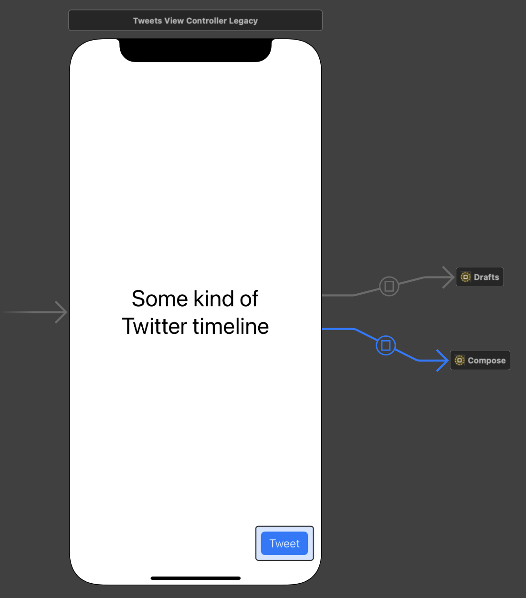
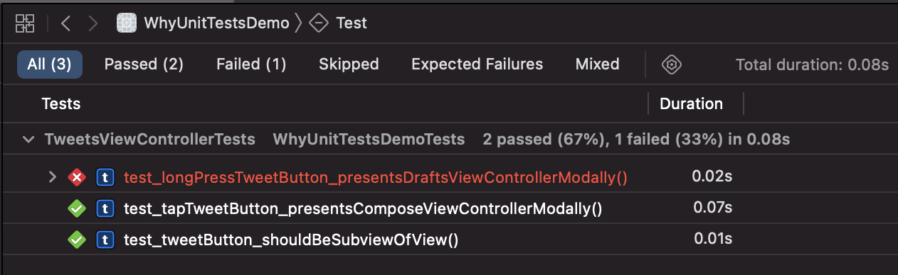
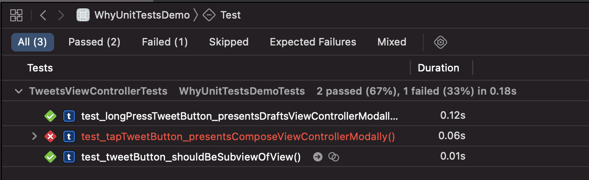

# Testing the "Untestable"

I often complain on Twitter that SwiftUI code is not testable with unit tests.
Every time I get asked what the value of such tests would be.

Why should anyone write unit tests for user interface code?
Is that even possible?
And wouldn't the testers see bugs in the user interface immediately?
So why the hurdle?

## The situation

Let's assume there is a team of 2 iOS devs (Masha and Bill) working on a Twitter client.
It's old code and therefore it is still written partly in ObjC.
The storyboard of one of the parts of the app looks like this:



When the user taps the Tweet button, the compose view is presented modally.
But there is a hidden feature.
When the user press and holds the Tweet button, a view with the tweet drafts of the user is presented (as it is implemented in the official Twitter iOS app).
The users who know this feature use it quite often.

The relevant code looks like this:

```objc
@interface TweetsViewController ()
@property (weak, nonatomic) IBOutlet UIButton *tweetButton;
@end

@implementation TweetsViewController

- (void)viewDidLoad {
  [super viewDidLoad];
  
  UILongPressGestureRecognizer *longPressRecognizer = 
    [[UILongPressGestureRecognizer alloc]
     initWithTarget:self
     action:@selector(showDrafts:)];
  [self.tweetButton addGestureRecognizer:longPressRecognizer];
}

- (void)showDrafts:(UIGestureRecognizer *)sender {
  [self performSegueWithIdentifier:@"showDrafts" sender:self];
}

@end
```

## Refactoring to Swift

The team decides to refactor to Swift.
They know that refactoring code is dangerous and can break things.
Marsha read in a book about good software development practice that one should add tests before refactoring to make it easier.

Among others they add the following test:

```swift
func test_longPressTweetButton_presentsDraftsViewControllerModally() throws {
  addTeardownBlock {
    self.tearDownPresentation(in: self.sut)
  }
  let button = try XCTUnwrap(sut.value(forKey: "tweetButton") as? UIButton)
  let longPress = try XCTUnwrap(button.gestureRecognizers?
                                  .first(where: { gestureRecognizer in
    return gestureRecognizer is UILongPressGestureRecognizer
  }))
  
  longPress.state = .ended
  
  let asyncExpectation = expectation(description: "async")
  DispatchQueue.main.asyncAfter(deadline: .now() + .milliseconds(100)) {
    asyncExpectation.fulfill()
  }
  wait(for: [asyncExpectation], timeout: 1)
  XCTAssertTrue(sut.presentedViewController is TweetDraftsViewController))")
}
```

This test fetches the long press gesture recogniser attached to the tweet button and executes it.
Then it asserts that an instance of `TweetDraftsViewController` is presented modally.
How this test works is not important for this article.

While refactoring to Swift Bill forgets to add the long press gesture recogniser because he never uses it.
(Don't blame Bill for this.
This code looks easy here because I want to make my point clear.
In reality code is never that easy and straight forward.)

```swift
import UIKit

class TweetsViewController: UIViewController {
  
  @IBOutlet weak private(set) var tweetButton: UIButton!
}
```

He runs the tests and gets a reminder that there is a feature missing.



The tests showed the regression right away without letting internal testers or beta testers using the app.
So the bug didn't feel like a bug.
It felt more like integrated in the development process.

Bill fixes the bug:

```swift
import UIKit

class TweetsViewController: UIViewController {
  
  @IBOutlet weak private(set) var tweetButton: UIButton!
  
  override func viewDidLoad() {
    super.viewDidLoad()
    
    let longPressRecognizer = 
      UILongPressGestureRecognizer(target: self,
                                   action: #selector(showDrafts(_:)))
    tweetButton.addGestureRecognizer(longPressRecognizer)
  }
  
  @objc func showDrafts(_ sender: UIGestureRecognizer) {
    performSegue(withIdentifier: "showDrafts", sender: self)
  }
}
```

They ship a new version and everyone is happy.

A few month later Masha accepts a job offer from Apple and Dana joins the team.
Dana does not like Storyboads and convinces Bill to switch to user interface in code.

## Refactoring away from Storyboard

She refactors the `TweetsViewController` away from the Storyboard and is happy that there are unit tests that help with the expected features.
After refactoring Dana runs the tests and get a failure.



Here is the regression.
Can you spot it?

```swift
override func loadView() {
  let contentView = TweetsView()
  contentView.tweetButton.addTarget(self,
                                    action: #selector(showCompose(_:)),
                                    for: .touchDown)
  view = contentView
}
```

The reason for the test failure is that she selected the wrong `UIControl.Event` in the auto completion.
Instead of using `.touchUpInside` she selected `.touchDown`.
This bug is especially interesting because while using the app it looks like composing still works but the long press gesture seems broken.

With the help of the test, she can quickly fix the bug.

## Refactoring to SwiftUI

Dana and Bill watched some of the sessions in WWDC21 and decide to switch to SwiftUI.
SwiftUI is not testable with unit tests.
Their only option is to add UI tests.
But in the past when ever they used UI tests they stopped running them after a few days because they where painfully slow and they often broke.

## The value of unit tests

For me the value of unit tests it that they are fast, reliable and easy to write.
They sit in your project, making sure that the tested features keep working.
The team can refactor fearlessly.
This way the code can held in good shape without breaking tested features.

You can even use unit tests to get used to unknown frameworks.
And you can add unit tests to write down all the features a component needs to implement.
By doing so, you can focus on small pieces of functionality and the tests help with the bigger picture.

## Feedback

I wrote a feedback about that in 2019 (FB6134940).
It is still open.
I do not expect that Apple will make SwiftUI testable.
People in charge seem to see not value in that.
This post shows my point of view.
