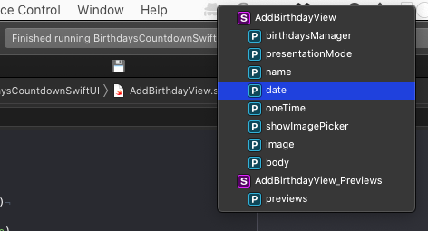
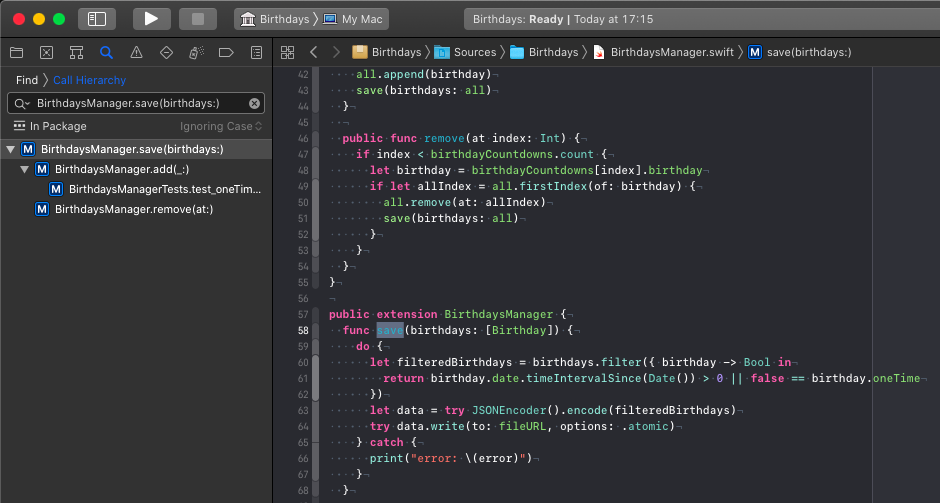

# Xcode Shortcuts I Use The Most

## Open Quickly: ⌘⇧O

Open Quickly opens a pop-up window with a search field.
When you start typing, Xcode shows you all matching results in the open project or work space.

I use this shortcut all the time to open a class, a struct or an enum I need to change.
For example, I have a [break point](../a-breakpoint-i-cannot-live-without/), that prints the currently active view controller to the debug output.
When I see a bug in the simulator, I copy the name of the relevant view controller from the debug output and search for it using Open Quickly.

Use the arrow keys to navigate in the list of the search results and press return to navigate to the selected result.
If you hold down the Option key and press return, Xcode opens the result in the assistant editor.

## Jump To Definition: ⌃⌘J

Select a property or a method and press ⌃⌘J to jump to the definition of that element.
I often use this shortcut to figure out how something is implemented or to read the header of Apple framework classes.

## Move Line Up: ⌘⌥[

Put the cursor in the line you like to move then use ⌘⌥[ to move it up, and ⌘⌥] to move it one line down.
This also works with a selection of lines.
These shortcuts are especially useful when working with SwiftUI when you don't know the correct order of the view modifiers.

## Re-Indent: ⌃I

When copy-pasting code from another project or from StackOverflow, you often need to fix the indentation.
You can use ⌃I to re-indent the selected lines.

## Find: ⌘F

Use this shortcut to search in the current file.
If you click the drop down menu in the search bar, you can change the search parameters.
You can even use regular expression in the search field.

## Find And Replace: ⌘⌥F

Search in the current file and replace the search results with a new string.

## Reveal In Project Navigator: ⌘⇧J

Show the currently open file in the project navigator.
This is great when you opened a file using Open Quickly and need to know where this file is located in the project.

## Show Document Items: ⌃6

If you search for a specific method or property in the currently open file, you can use the shortcut ⌃6.
This opens a drop down list with all the properties and methods.

If you start typing while the drop down list is open, Xcode filters the shown results accordingly.
Here again you can navigate using the arrow keys and jump to the method by pressing return.

## Find In Project: ⌘⇧F

Search in the project.

## Find Call Hierarchy: ⌘⌃⇧H

Select a method name and use the shortcut ⌘⌃⇧H to find all calls to this method and the hierarchy of those calls.

## Conclusion

The shortcuts shown here are the ones I use often, nearly daily.
But there are many more you might find useful, especially when you are still using Storyboards.
Many of the menu items of Xcode have shortcuts.
Look at the menu items to figure out the shortcuts.
Try to use at lease one of them today or tomorrow.

If you have questions or suggestions about this post, please let me know at Twitter: [@dasdom](https://twitter.com/dasdom).
