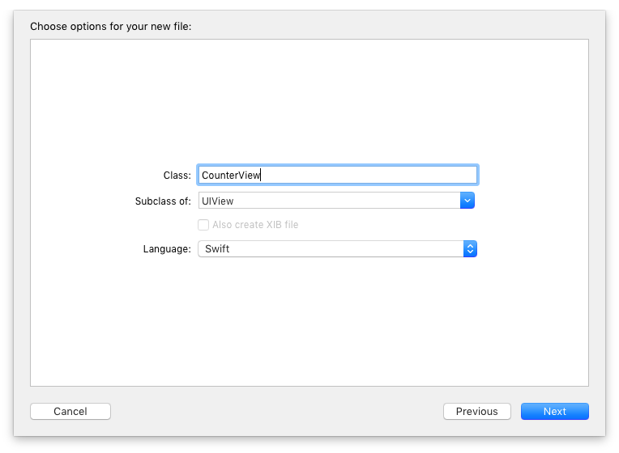

Before we start with the real app, we need to get a feeling about building user interfaces in code. We are going to build a simple counter app showing two labels and two buttons. It will look like this:



Don't worry, it's easier than you might think.

In fact we already changed the user interface in code in the last post. We set the `backgroundColor` of the view in `viewDidLoad()`. As the name suggests, `viewDidLoad()` is called after the view did load but before it is rendered on screen. So, when building the user interface (UI) in code, are we supposed to put all the UI code into this method?

In documentation of `viewDidLoad()` we find this:

> This method is called after the view controller has loaded its view hierarchy into memory. This method is called regardless of whether the view hierarchy was loaded from a nib file or created programmatically in the `loadView()` method. You usually override this method to perform additional initialization on views that were loaded from nib files.

So this method is used to perform additional initialisation in case the user interface is loaded from nibs (i.e. when the UI is build in Interface Builder). This make sense because some properties cannot be set using Interface Builder.

But we are going to do all UI in code. We need to put our code somewhere else. The docs for `viewDidLoad()` already tell us where the code belongs: `loadView()`. In the docs for `loadView()` we find:

> You can override this method in order to create your views manually. If you choose to do so, assign the root view of your view hierarchy to the view property. [...] Your custom implementation of this method should not call super.

So we could create an instance of `UIView`, add subviews and assign it to the view property. But this way, we would put view code into the view controller. View code belongs into its own class. The view code should be separated from the view controller to make it reusable in other places of the app. We need a new class; a subclass of `UIView`.

In the project we created in the last post, add a new class using the Cocoa Touch Class template. Make it a subclass of `UIView` and call it `CounterView`.


The view is going to show two labels and two buttons. We add those as properties to the view class.

```swift
class CounterView: UIView {
  let labelOne: UILabel
  let labelTwo: UILabel
  let buttonOne: UIButton
  let buttonTwo: UIButton
}
```

These properties are set in the initialiser of that view.

```swift
override init(frame: CGRect) {
    
    labelOne = UILabel()
    labelOne.translatesAutoresizingMaskIntoConstraints = false
    labelOne.textAlignment = .center
    labelOne.text = "0"
    
    labelTwo = UILabel()
    labelTwo.translatesAutoresizingMaskIntoConstraints = false
    labelTwo.textAlignment = .center
    labelTwo.text = "0"
    
    buttonOne = UIButton(type: .system)
    buttonOne.translatesAutoresizingMaskIntoConstraints = false
    buttonOne.setTitle("Player One", for: .normal)
    buttonOne.tag = 1
    
    buttonTwo = UIButton(type: .system)
    buttonTwo.translatesAutoresizingMaskIntoConstraints = false
    buttonTwo.setTitle("Player Two", for: .normal)
    buttonTwo.tag = 2
    
    super.init(frame: frame)
}
```

Before there was Auto Layout, views had to be positioned on screen using screen coordinates. In addition they had auto resizing masks to describe how the view size should react when the size of the superview (= the view containing the view) changed. For example one could tell UIKit that the view should keep the distances to the edges of the superview constant.

When Auto Layout was introduced Apple decided that auto resizing masks would be translated into constraints automatically. This way, the UI looked the same even though the layout engine had been changed. Clever!

When using Auto Layout, you usually don't want to add constraints based on auto resizing masks. Usually you want to add all constraints yourself. There is a property on `UIView` to disable the translation of the auto resizing masks, `translatesAutoresizingMaskIntoConstraints`. The Interface Builder sets this property to `false` when you add a constraint to a view.

We have to do the same. In the code above for all the subviews to be added to the view `translatesAutoresizingMaskIntoConstraints` is set to `false`.

Next the labels and buttons are added as subviews to the view.

```swift
    addSubview(labelOne)
    addSubview(labelTwo)
    
    addSubview(buttonOne)
    addSubview(buttonTwo)
```

To position the views on screen, we need Auto Layout Constraints. At this point you don't need to understand how they work. Type them word by word as they are written here. Later in the book it will become clear how they work.

```swift
    NSLayoutConstraint.activate([
      labelOne.leadingAnchor.constraint(
        equalTo: leadingAnchor, constant: 20),
      
      labelTwo.leadingAnchor.constraint(
        equalTo: labelOne.trailingAnchor, constant: 20),
      labelTwo.trailingAnchor.constraint(
        equalTo: trailingAnchor, constant: -20),
      labelTwo.widthAnchor.constraint(
        equalTo: labelOne.widthAnchor),
      labelTwo.topAnchor.constraint(
        equalTo: labelOne.topAnchor),
    
      buttonOne.centerXAnchor.constraint(
        equalTo: labelOne.centerXAnchor),
      buttonOne.topAnchor.constraint(
        equalTo: labelOne.bottomAnchor, constant:20),
      
      buttonTwo.centerXAnchor.constraint(
        equalTo: labelTwo.centerXAnchor),
      buttonTwo.topAnchor.constraint(
        equalTo: buttonOne.topAnchor),
      
      buttonOne.centerYAnchor.constraint(
        equalTo: centerYAnchor),
      ])
```

We are nearly finished with the view code. But in Swift if you subclass a class you need to override all required initialiser. `UIView` has one required initialisers `init(coder:)`, which is used by UIKit when the view is loaded from an archive (like a nib). In our little app `init(coder:)` will never be called. In this case it's ok to trap in a fatal error.

```swift
required init?(coder aDecoder: NSCoder) {
  fatalError("init(coder:) has not been implemented")
}
```

That's it for the view code.

If you have any feedback please ping be on [Twitter](https://twitter.com/dasdom).
