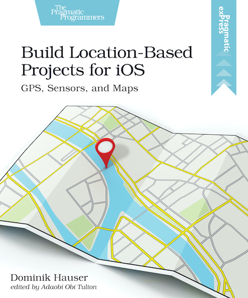
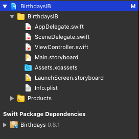

As an iOS developer you need to be able to build the user interface of your apps using different approaches.
Without using a third party library you can mainly choose between Storyboards, using code to build the user interface, and SwiftUI.
Each of these has it's advantages and disadvantages and each developer has a preference.

I think beginners should learn about these different approaches right from the start.
That's why I use all three in my book [Build Location-Bases Projects for iOS](https://pragprog.com/book/dhios/build-location-based-projects-for-ios).
I'm quite proud of it and I think you should check it out.

{:refdef: style="text-align: center;"}

{:refdef}

In this and the next two blog posts I will show you how to build one app using these different approaches.
The app we build is a birthday countdown app.
You can add the birthdays of your loved ones and the app shows you the number of days until their next birthday.
It will look like this:

{:refdef: style="text-align: center;"}

{:refdef}

(From the number you can reconstruct when I wrote the blog post. ;))

In this post we will use a Storyboard for the user interface.

> Note:   
> We will put all the screens in one Storyboard because it's a small and simple app.
> In a real app, you might want to split the user interface into several Storyboards.
> Let me know when you like to see a post about that in the future.

We want to concentrate on the differences in building the user interface.
Adding and storing the birthday data would distract from the main topic.
We will use a Swift package that I wrote for this blog mini series to hide how this works.

### Creating The Xcode Project

Open Xcode and create a new project using the shortcut ⌘⇧N.
Choose the Single View App template and click Next.
Type in the name BirthdaysIB, select the language Swift, select Storyboard for the User Interface and deselect the check boxes for Core Data, Include Unit Tests and Include UI Tests.
We won't write tests in this demo app and storing the data is manages by the Swift package we will include.

{:refdef: style="text-align: center;"}

{:refdef}

Click Next, choose a location on your disk to store the project and click Create.

Next we add the package that will manage the birthday data.

### Adding The Swift Package

Select the Xcode menu item `File > Swift Packages > Add Package Dependency` and paste the package URL `https://github.com/dasdom/Birthdays` into the search field.
Click Next, click Next again and click Finish.
Xcode adds the package to the project.
Subsequently the project navigator should look like this:

{:refdef: style="text-align: center;"}

{:refdef}

### Creating The Birthday Countdown View

Now let's create the user interface that shows the remaining days until the next birthdays.
Click `Main.storyboard` to open it in the Interface Builder, show the library using the shortcut ⌘⇧L and drag a `UITableViewController` into the Storyboard.
Open the attributes inspector with the shortcut ⌥⌘5 and check the check box next to Is Initial View Controller.
Delete the View Controller Scene from the Storyboard.

> Note:   
> With all the enhancements in `UICollectionView` in iOS 13 and iOS 14 the user interface could easily be implemented using a collection view with compositional layout.
> In fact we will do that in the chapter in which we build this app without a storyboard.
> In this chapter we will use a `UITableView` because in a storyboard we can only use a collection view flow layout.

Open the library again and drag two labels into the table view cell of the table view.
Select both labels by clicking one of them and pressing the ⌘ key while you click the other one.
Then click the Embed button (the one with the arrow pointing into a box) in the lower right corner of the interface builder.
In the pop up window select Stack View:

{:refdef: style="text-align: center;"}

{:refdef}

Stack views are a very powerful tool to easily create complex layouts.
They layout their arranged views vertically or horizontally and you only have to configure a few variables.
See for example [UIStackViewPlayground]({{ site_url }}/uistackviewplayground/).

With the created stack view selected, open the attributes inspector using the shortcut ⌥⌘5.
Look for the setting with the name Spacing.
This value defines the spacing between the arranged sub views of the stack view.
Type in the value `10` and press return.
The Interface Builder reduces the size of the stack view such that it just large enough to embed its sub views respecting the set spacing.

Next we need to add layout constraints to define the position of the stack view within the table view cell.
Select the stack view and click the Add New Constraint button (the one with the square between the vertical lines) in the lower right of the Interface Builder.
Xcode opens a pop up window in which we can define the constraints we want to add.
Type in `0` into the four text fields in the upper third of the pop up and make sure the red markers are selected like shown in the following image:

{:refdef: style="text-align: center;"}

{:refdef}

Click Add 4 Constraints.
After adding the constraints, Interface Builder shows a red circle with a black arrow in the structure overview of the storyboard to indicate that there is a problem with the added layout constraints.

{:refdef: style="text-align: center;"}

{:refdef}

Click the button to figure out, what the problem is.
The shown information is a bit confusing so let me explain what the problem is.
We haven't told the stack view exactly how it should layout its sub views.
We just told it that the spacing should be exactly 10 points.
But what should be the width of the labels?
And which of the labels should shrink if there is not enough space to show both?

We have to tell the stack view, or more precisely the layout system what to do.
The easiest way to solve this problem is to tell the layout system that the label on the right should pull its edges inward.
Select the right button, open the size inspector (⌥⌘6) and set the horizontal hugging priority to 252 as show in the following image:

{:refdef: style="text-align: center;"}

{:refdef}

Subsequently the error indicator in the structure overview is gone.
Let's make the user interface a little bit more pleasing.
Select the left label, open the attributes inspector and change the font style to bold.

### Embedding in a Navigation Controller

The user should see what this app is about.
Let's embed the view controller into a navigation controller to add a navigation bar to put the title in.
This has the great advantage that we can put the button to add birthdays to the list there as well.

In the Interface Builder select the table view controller and click the Xcode menu item *Editor / Embed In / Navigation Controller*.
Next select the navigation bar of the added navigation controller and open the attribute inspector (⌥⌘5).
Check the check box at Prefers Large Titles.
Then click the navigation bar in the table view controller and type in the title "Birthdays".

Next we are going to add the source code for the birthday countdown list.
### BithdayCountdownViewController

First remove the file *ViewController.swift*.
Next use the shortcut ⌘N to add a new Cocoa Touch Class.
Type in the name `BirthdaysCountdownViewController` and make it the subclass of `UITableViewController`.
Make sure the check box at Also create XIB file is not selected and the language is set to Swift.
Click Next and the click Create.

The birthdays are managed by our Birthdays package so we need to import it into this file.
The package uses Combine to publish changes to the list of birthdays.
Add the following import statements to `BirthdaysCountdownViewController` below the existing import statement:


import Birthdays
import Combine


Next add the following property of a `BirthdaysManager` to `BirthdaysCountdownViewController`:


private let birthdaysManager = BirthdaysManager()


You don't need to understand how the `BirthdaysManager` works for this blog series.
You only need to know that you can add birthdays and subscribe to changes via Combine.

To be notified when something in the list of birthday countdowns changes, we need to subscribe to the corresponding Combine publisher.
Add the following property to `BirthdaysCountdownViewController`:


private var subscription: AnyCancellable?


We also need a property to hold the birthdayCountdowns to be shown in the table view.
Add the following property for and array of `BirthdayCountdown`s:


private var birthdayCountdowns: [BirthdayCountdown] = [] {
  didSet {
    self.tableView.reloadData()
  }
}


When ever the array with the birthday countdowns changes, we just reload the table view.
Usually you wouldn't reload the whole table view when only one of the entries changes but for the moment this is OK because adding new birthdays countdowns will we handled in another view.

To subscribe to changes add the following code at the end of `viewDidLoad()`:


subscription = birthdaysManager.$birthdayCounts
  .sink(receiveValue: { birthdayCounts in
    self.birthdayCountdowns = birthdayCounts
  })


With this code we subscribe to changes in the birthday counts array in the `Birthdays` package.

In the storyboard we added some label to the table view cell.
We also need a class for that table view cell to be able to connect the code of the cell with the cell in the storyboard.
Add a new Cocoa Touch Class to the project using the shortcut ⌘N, type in the name BirthdayCountdownCell and make it a subclass of `UITableViewCell`.
Remove the code in the created class.

Next we need to connect the storyboard with the code.
Open `Main.storyboard`, select the table view controller and open the identity inspector (⌥⌘4).
In the text field next to Class type in the name `BirthdaysCountdownViewController` and press return.

Then select the table view cell and set the class in the identity inspector to `BirthdayCountdownCell`.

