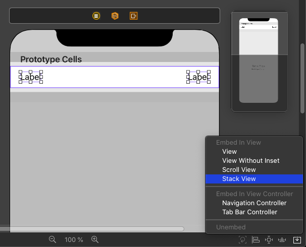

As an iOS developer you need to be able to build the user interface of your apps using different approaches.
Without using a third party library you can mainly choose between Storyboards, using code to build the user interface, and SwiftUI.
Each of these has it's advantages and disadvantages and each developer has a preference.

I think beginners should learn about these different approaches right from the start.
That's why I use all three in my book [Build Location-Bases Projects for iOS](https://pragprog.com/book/dhios/build-location-based-projects-for-ios).
I quite proud of it and I think you should check it out.

In this and the next two blog posts I will show you how to build one app using these different approaches.
The app we build is a birthday countdown app.
You can add the birthdays of your loved ones and the app shows you the number of days until their next birthday.
It will look like this:

{:refdef: style="text-align: center;"}

{:refdef}

(From the number you can reconstruct when I wrote the blog post. ;))

In this post we will use a Storyboard for the user interface.

> Note:   
> We will put all the screens in one Storyboard because it's a small and simple app.
> In a real app, you might want to split the user interface into several Storyboards.
> Let me know when you like to see a post about that in the future.

We want to concentrate on the differences in building the user interface.
Adding and storing the birthday data would distract from the main topic.
We will use a Swift package that I wrote for this blog mini series to hide how this works.

### Creating The Xcode Project

Open Xcode and create a new project using the shortcut ⌘⇧N.
Choose the Single View App template and click Next.
Type in the name BirthdaysIB, select the language Swift, select Storyboard for the User Interface and deselect the check boxes for Core Data, Include Unit Tests and Include UI Tests.
We won't write tests in this demo app and storing the data is manages by the Swift package we will include.

{:refdef: style="text-align: center;"}

{:refdef}

Click Next, choose a location on your disk to store the project and click Create.

Next we add the package that will manage the birthday data.

### Adding The Swift Package

Select the Xcode menu item `File > Swift Packages > Add Package Dependency` and paste the package URL `https://github.com/dasdom/Birthdays` into the search field.
Click Next, click Next again and click Finish.
Xcode adds the package to the project.
Subsequently the project navigator should look like this:

{:refdef: style="text-align: center;"}

{:refdef}

### Creating The Birthday Countdown View

Now let's create the user interface that shows the remaining days until the next birthdays.
Click `Main.storyboard` to open it in the Interface Builder, show the library using the shortcut ⌘⇧L and drag a `UITableViewController` into the Storyboard.
Delete the View Controller Scene from the Storyboard.

Open the library again and drag two labels into the table view cell of the table view.
Select both labels and click the Embed button (the one with the arrow pointing into a box) in the lower right corner of the interface builder.
In the pop up window select Stack View:

{:refdef: style="text-align: center;"}

{:refdef}

Stack views are a very powerful tool to easily create complex layouts.
They layout their arranged views vertically or horizontally and you only have to configure a few variables.
See for example [UIStackViewPlayground]({{ site_url }}/uistackviewplayground/).

With the created stack view selected, open the attributes inspector using the shortcut ⌥⌘5.
Look for the setting with the name Spacing.
This value defines the spacing between the arranged sub views of the stack view.

