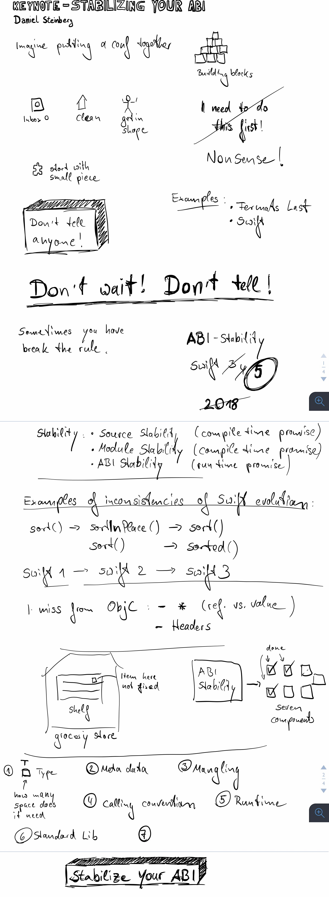
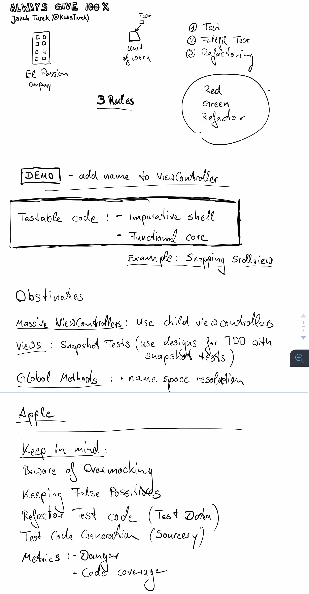
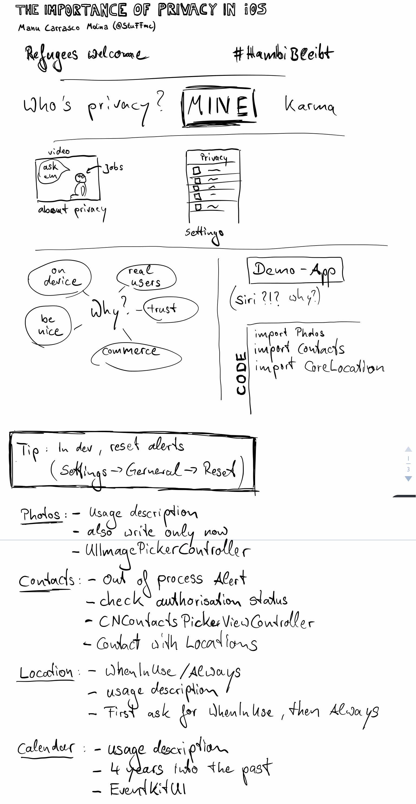
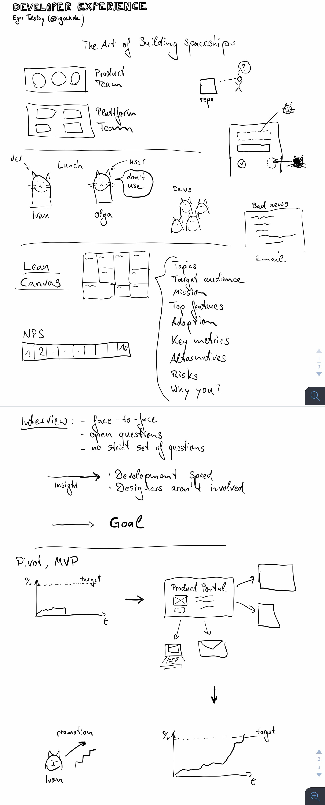
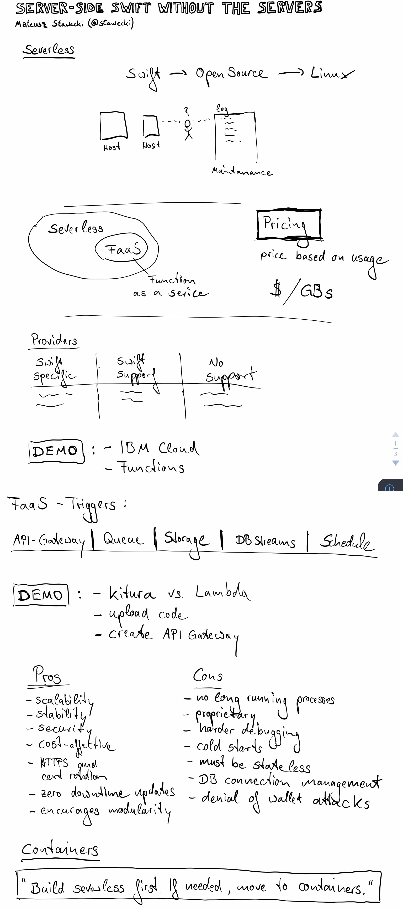
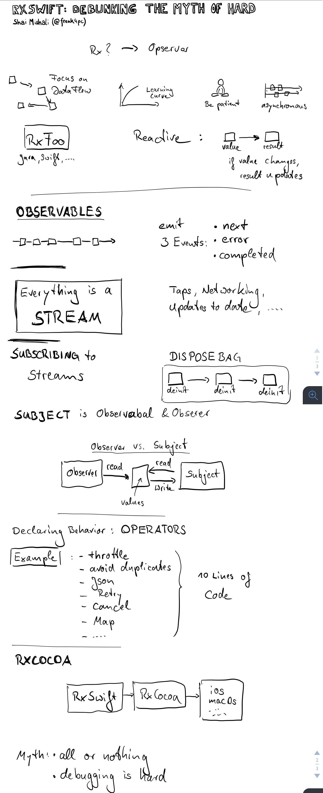
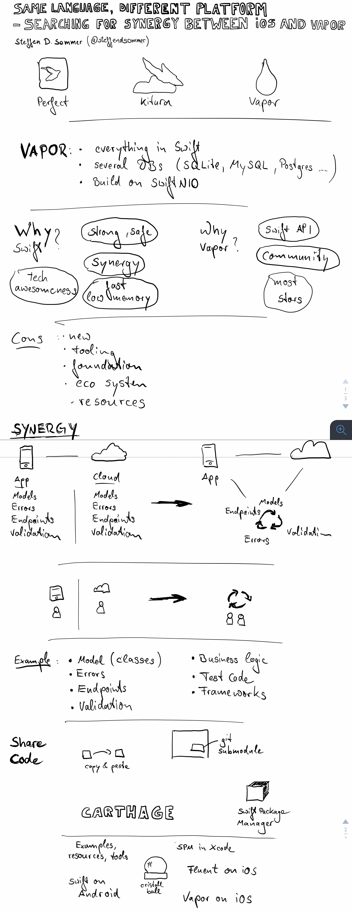
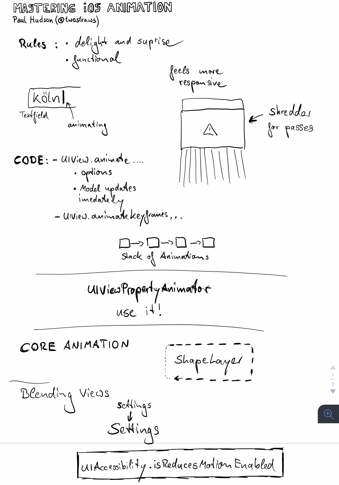
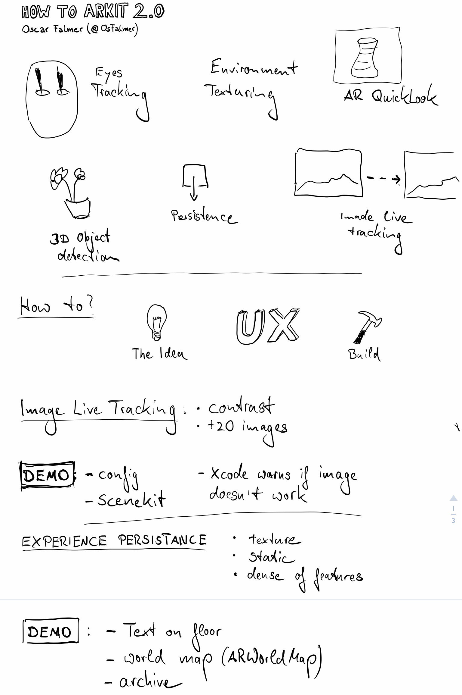
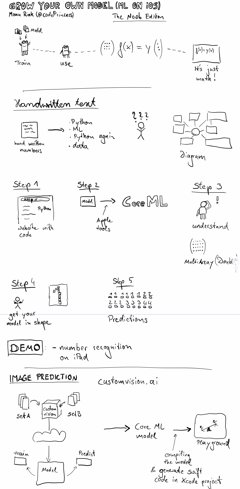

# Day 1

## Keynote – Stabilizing your ABI
[Daniel Steinberg](https://twitter.com/dimsumthinking)

**Teaser on SwiftConf.com:**
> The focus of Swift 5 is ABI stabilization. This is a big moment in the evolution of this language we depend so much on. We begin this year’s Swift Conf with a look at what ABI Stabilization means in the life of the Swift Programming Language and what it could mean in your life.

**Sketch notes:**

-----
-----

## Always Give 100%
[Jakub Turek](https://twitter.com/KubaTurek)

**Teaser on SwiftConf.com:**
> The talk is about unit testing and developing iOS apps in TDD with Swift. It will cover a plethora of tips and techniques that me and the team has discovered en route to the app with 200K lines of Swift at nearly 100% code coverage. The talk will highlight the techniques of structuring the code so that it is easily testable. It will demonstrate how to overcome common pain points, such as testing view controllers or the test-first approach for views built entirely in code. It will also show how to refactor the test code for better readability, for example using Sourcery code generation tool. It doesn't matter whether you have never written a single test case or are a veteran looking to push the testing to the limit. If you are like me and want the days of debugging through piles of unmaintainable code to be over, this talk is definitely for you!

**Sketch notes:**

-----
-----

## The importance of Privacy in iOS
[Manuel “Stuff” Carrasco Molina](https://twitter.com/stuffmc)

**Teaser on SwiftConf.com:**
> A lot of time Privacy of my data as a user is not a priority for Developers. Wether it’s my calendar, my contacts, my location, I want as a user to be able to use an app without all of those attacks in my privacy. I want to summarize some things an iOS developer should do to ensure the most critical user can still use my app in some regards, and not just say “I need all your information” like on other platforms. This is the beauty of iOS, being able to fine grained (although not enough) so let’s do this all together, as a beautiful community concerned by Privacy.

**Sketch notes:**

-----
-----

## Developer experience
[Egor Tolstoy](https://twitter.com/igrekde)

**Teaser on SwiftConf.com:**
> Problem validation, roadmaps, usage metrics and feedback, user experience are not first-class citizens in internal platforms and tools development. I'll talk about developer experience, an approach that helps our engineers create useful, thriving and developer-oriented technical products.

**Sketch notes:**

[**Slides**](https://speakerdeck.com/etolstoy/developer-experience-the-art-of-building-spaceships)

-----
-----

## Server-side swift without the servers?
[Mateusz Stawecki](https://twitter.com/stawecki)

**Teaser on SwiftConf.com:**
> Function as a service (FaaS) a.k.a. the mysterious “Serverless” is the latest frontier for cloud platforms like AWS, Azure, IBM Cloud. It promises to run your backend Swift code without having to worry about infrastructure or server maintenance. But what about your existing Kitura/Vapor applications? In this talk we’ll explore running Swift in the cloud without having to provision servers or containers. How Serverless can allow us to focus on doing what we love - writing Swift code - and sleep better at night without worrying about server uptime.

**Sketch notes:**

-----
-----

# Day 2

## RxSwift: debunking the myth of hard
[Shai Mishali](https://twitter.com/freak4pc)

**Teaser on SwiftConf.com:**
> RxSwift has been one of the most prominent and upcoming frameworks in the iOS & Swift community in the past years. Its usage is becoming widespread and popular with many companies moving their code base to the Reactive world across iOS, Android, Web and Backend - making it a valuable skill to comprehend. Along with that fact thought, it seems the learning curve for RxSwift and Rx in general always seems "hard" to most people, or too hard to get started with. In this lecture I hope to debunk the myth and misconception of RxSwift being a hard concept, and put developers on the right path to start building Reactive Mobile applications for the modern world.

**Sketch notes:**

-----
-----

## Same language, different platform - searching for synergy between iOS and Vapor
[Steffen Sommer](https://twitter.com/steffendsommer)

**Teaser on SwiftConf.com:**
> Being able to share code between an iOS app and a backend running server-side Swift was one of the first things I thought about when Swift went open source. It’s been a common argument for choosing a server-side Swift framework ever since, although there’s been little focus on what is actually possible. With this talk I will dive into the current possibilities and limitations for sharing code between iOS and Vapor and I will look ahead and discus how this might change in the future.

**Sketch notes:**

---
---

## Mastering iOS Animation
[Paul Hudson](https://twitter.com/twostraws)

**Teaser on SwiftConf.com:**
> We all know that animations help your apps look better, but they also help your readers understand what's changing in your app and why. In this session you'll learn how to make fantastic animations for iOS, using the latest APIs from Apple.

**Sketch notes:**

---
---

## How to ARKit 2.0
[Oscar Falmer](https://twitter.com/osfalmer)

**Teaser on SwiftConf.com:**
> ARKit 2.0 is coming up with iOS 12 with exciting new features such as Image Live Tracking and 3D Object Detection. Let’s dive into these two features with some technical aspects and code examples.

**Sketch notes:**

---
---

## Grow your own model (ML on iOS)
[Manu Rink](https://twitter.com/codePrincess)

**Teaser on SwiftConf.com:**
> Wouldn't it be great to "just" have an own machine learning model to detect if cats are smiling or just looking evil? Or detect the own handwriting in a split of a second - completely offline? It's easy, but not simple - so let's dive into it! This talk shows how to get started with ML by training your own model which then can be used with CoreML.

**Sketch notes:**

[**Blog post**](https://medium.com/@codeprincess/machine-learning-in-ios-for-the-noob-6c2cdd04b00b)

---
---

To the speakers: If you want my to not mention your talk, let me know.

---
---

If you have any feedback ping me on [Twitter](https://twitter.com/dasdom).