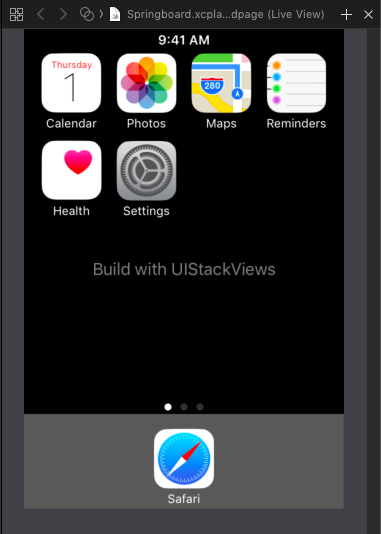

UIStackView was introduces with iOS 9. And from the beginning I loved it. UIStackViews allow to use Auto Layout without adding Auto Layout Constraints. And most of the times you get away with changing a few properties to achieve what you want. You need some time to get used to it though. So back when a beta of iOS 9 was available I created an [Xcode Playground](https://github.com/dasdom/UIStackViewPlayground) to experiment with the new and shiny UIStackViews.

First I did some easy layouts like a calculator and a simple Twitter feed. But later I tried to recreate the look of the springboard with UIStackViews. Here is the result:

{:refdef: style="text-align: center;"}

{:refdef}

Each App (the icon together with the title) is one stack view. 


let appStackView = { (imageName: String, title: String) -> UIStackView in
    
    let imageView = UIImageView(image: UIImage(named: imageName))
    imageView.widthAnchor.constraint(equalToConstant: 60).isActive = true
    imageView.heightAnchor.constraint(equalToConstant: 60).isActive = true
        
    let subviews = [imageView, labelWithText(title)]
    let stackView = UIStackView(arrangedSubviews: subviews)
    stackView.axis = .vertical
    stackView.distribution = .equalSpacing
    stackView.spacing = 3
    return stackView
}

let calendarStackView = appStackView("calendar", "Calendar")
let photosStackView = appStackView("photos", "Photos")
let mapsStackView = appStackView("maps", "Maps")
let remindersStackView = appStackView("notes", "Reminders")
let healthStackView = appStackView("health", "Health")
let settingsStackView = appStackView("settings", "Settings")
let safariStackView = appStackView("safari", "Safari")


The Calendar and the Health app are together a stack view as well as Photos and Settings.


let columnStackView = { (views: [UIView]) -> UIStackView in
    let stackView = UIStackView(arrangedSubviews: views)
    stackView.axis = .vertical
    stackView.spacing = 10
    stackView.distribution = .fillEqually
    return stackView
}

let firstColumnStackView = columnStackView([calendarStackView,
                                            healthStackView])
let secondColumnStackView = columnStackView([photosStackView,
                                             settingsStackView])


The first two columns with apps and the two other apps are put into another stack view:


let appsStackView = UIStackView(arrangedSubviews: [firstColumnStackView,
                                                   secondColumnStackView,
                                                   mapsStackView,
                                                   remindersStackView])
appsStackView.distribution = .fillEqually
appsStackView.alignment = .top
appsStackView.spacing = 15


Safari is in a stack view and together with the page control it's put into another stack view. The stack view with the apps is put into another stack view together with the time label:


let topStackView = UIStackView(arrangedSubviews: [timeLabel, appsStackView])
topStackView.axis = .vertical
topStackView.spacing = 5


And then the top stack view is put into another stack view together with the info label and the stack view at the bottom with Safari and the page control. And this last stack view is added to the view as a sub view and it is arranged using normal Auto Layout Constraints.


let mainStackView = UIStackView(arrangedSubviews: [topStackView, infoLabel, safariColumnStackView])
mainStackView.translatesAutoresizingMaskIntoConstraints = false
mainStackView.axis = .vertical
mainStackView.distribution = .equalSpacing
mainStackView.alignment = .center

hostView.addSubview(dockBackgroundView)
hostView.addSubview(mainStackView)

NSLayoutConstraint.activate(
  [
    mainStackView.leadingAnchor.constraint(equalTo: hostView.leadingAnchor),
    mainStackView.trailingAnchor.constraint(equalTo: hostView.trailingAnchor),
    mainStackView.topAnchor.constraint(equalTo: hostView.topAnchor, constant: 3),
    mainStackView.bottomAnchor.constraint(equalTo: hostView.bottomAnchor, constant: -3),
    
    dockBackgroundView.leadingAnchor.constraint(equalTo: hostView.leadingAnchor),
    dockBackgroundView.trailingAnchor.constraint(equalTo: hostView.trailingAnchor),
    dockBackgroundView.bottomAnchor.constraint(equalTo: hostView.bottomAnchor),
    dockBackgroundView.heightAnchor.constraint(equalToConstant: 95),
  ])
  
  
  As you can see in this post, stack views become very powerful when you nest them. So, stack all the things!
  
  Follow me on [Twitter](https://twitter.com/dasdom) and browse through my other open source stuff on [Github](https://github.com/dasdom).
