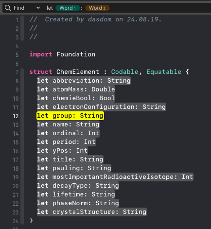
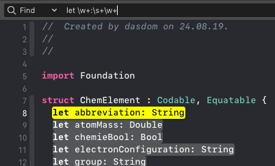
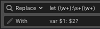

Recently I took the regex course at [executeprogram.com](https://www.executeprogram.com/). Awesome stuff.

As you know, as soon as you have a slight idea what regex is, you try to use it everywhere. Yesterday I needed to change all strings of double values in a JSON into double values. For example I wanted to replace `"1.23"` with `1.23`. 

# Regex without the `\d+.*?\w`

If you don't know regular expressions but still need more than just replace a simple string with another simple string, Xcode has you covered.

As an example lets say we'd like to change all the properties in the following struct into optionals:


struct ChemElement : Codable, Equatable {
  let abbreviation: String
  let atomMass: Double
  let electronConfiguration: String
  let group: String
  let name: String
  let ordinal: Int
  let period: Int
  let yPos: Int
  let title: String
  let pauling: String
  let mostImportantRadioactiveIsotope: Int
  let decayType: String
  let lifetime: String
  let phaseNorm: String
  let crystalStructure: String
}


(Please don't judge this code. I'm still refactoring. ;) )

We activate search with ⌘-f. In the search bar is a plus sign. When you click it, you can select different elements to search for. The patterns we need is `let Word: Word`. The matching substrings are highlighted in the editor: 

{:refdef: style="text-align: center;"}

{:refdef}

If you look closely you can see there is a small number next to the pattern elements:

{:refdef: style="text-align: center;"}

{:refdef}

In the `Replace` text field you can refer to the different matches using a `$` sign and the number next to the pattern part like this: `var $1: $2?`. In Xcode this looks like this:

{:refdef: style="text-align: center;"}

{:refdef}

When we now click the `All` button, all the properties are changed into optional properties:


struct ChemElement : Codable, Equatable {
  var abbreviation: String?
  var atomMass: Double?
  var chemieBool: Bool?
  var electronConfiguration: String?
  var group: String?
  var name: String?
  var ordinal: Int?
  var period: Int?
  var yPos: Int?
  var title: String?
  var pauling: String?
  var mostImportantRadioactiveIsotope: Int?
  var decayType: String?
  var lifetime: String?
  var phaseNorm: String?
  var crystalStructure: String?
}


# Search using regular expressions

If you know regular expressions you can activate it in search by clicking the drop down that shows `Contains` and change it into `Regular Expression`:

{:refdef: style="text-align: center;"}

{:refdef}

Than you can use regular expressions when searching:

{:refdef: style="text-align: center;"}

{:refdef}

But if you'd like to use matches in `Replace` like you did above you need to add parentheses like this:

{:refdef: style="text-align: center;"}

{:refdef}

**Thanks for reading!**

If you have comments about this or in case I missed something, you can find me on [Twitter](https://twitter.com/dasdom).
