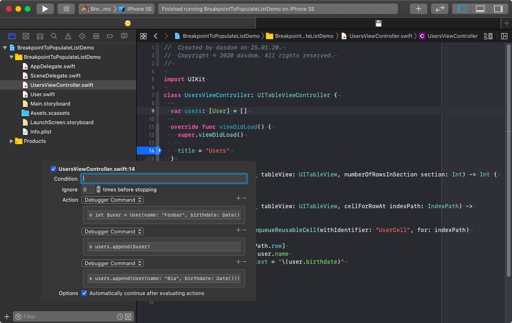

Often during development, you need to populate the view controller with demo data.
One solution is to change the code to use dummy data.
But this means you have to change the code and remember to change it back when done.

I often use a breakpoint for this.
Using the keyword `e` (short for `expression`) you can execute code when the debugger hits the breakpoint.

Let's say we have a table view showing users.
With the following lldb command we can add a user object to the `users` array in a breakpoint in `viewDidLoad`.


e users.append(User(name: "Bla", birthdate: Date()))


You can even split the creation and the appending in two debugger commands like shown in the following screenshot.

{:refdef: style="text-align: center;"}

{:refdef}

Follow me on [Twitter](https://twitter.com/dasdom).   
Check out my open source code at [Github](https://github.com/dasdom).
