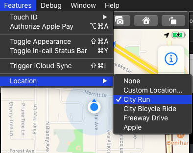
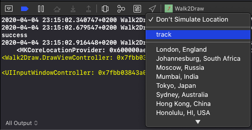

Sometimes when building an iOS app you need to simulate moving around.
Let's say, for example, you create an app that allows the users to draw their movement onto a map.
It would be difficult to move around with your iOS device connected to Xcode to debug your code.

Fortunately the iOS simulator can simulate location changes as if the user would do a city run or a free way drive.

## Simulate a City Run Around Cupertino

Build and run your app on the iOS simulator and select the menu item *Features / Location / City Run*.

{:refdef: style="text-align: center;"}

{:refdef}

The simulator delivers location updates as if the device would move during a city run around Cupertino.
But sometimes you need more.

## Simulate a Specific Path

If you need to simulate a specific path, you can add a gpx file to the project and select this in Xcode when the app runs in the simulator.
Such a gpx file could look like this:

```
<?xml version="1.0"?>
<gpx version="1.1" creator="GPXRouteCreator">
  <wpt lat="51.24254280000747" lon="6.769857406333074">
    <time>2020-02-28T09:12:35Z</time>
  </wpt>
  <wpt lat="51.24262905838532" lon="6.76984702684905">
    <time>2020-02-28T09:12:37Z</time>
  </wpt>
</gpx>
```

Each point in this gpx file defines a latitude and a longitude and an optional time.
When using a gpx file with time values the simulator uses the time difference between those points to simulate the movement.
The shorter the time difference between two points is, the faster the simulated movement.

Add the gpx file to the project and run your app on the simulator.
In the debug bar in Xcode click the location icon and select the file you added to the project.
In this example here I named the file `track.gpx`.

{:refdef: style="text-align: center;"}

{:refdef}

When the simulator reaches the last point in the gpx file, it starts at the beginning again.

## Creating GPX Files

You can write the gpx files you need yourself, or you can use [the open source app](https://github.com/dasdom/GPXRouteCreator) I build for my own needs.
Its a SwiftUI Catalyst app, so there are a few rough edges.
But it can create gpx files.

Let me know what you think.

Follow me on [Twitter](https://twitter.com/dasdom).   
Check out my open source code at [Github](https://github.com/dasdom).
