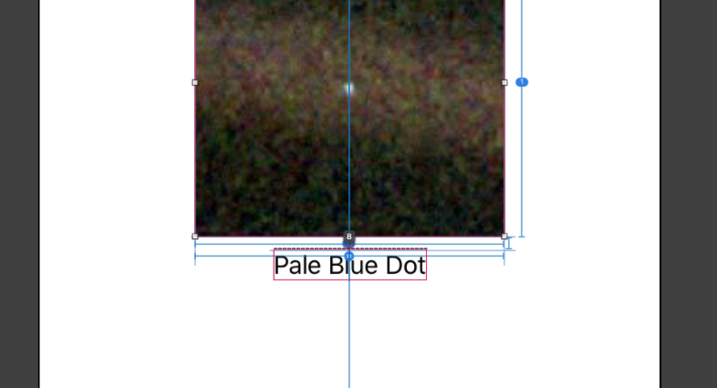
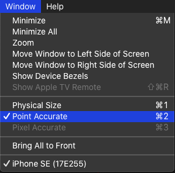
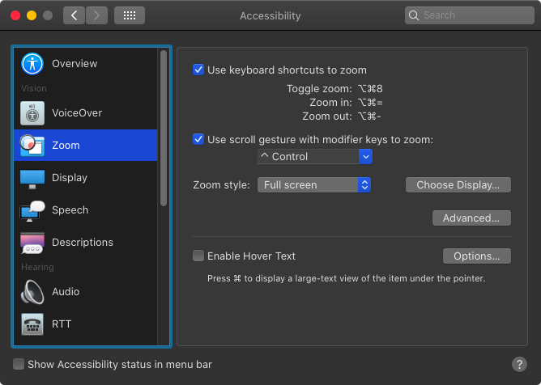
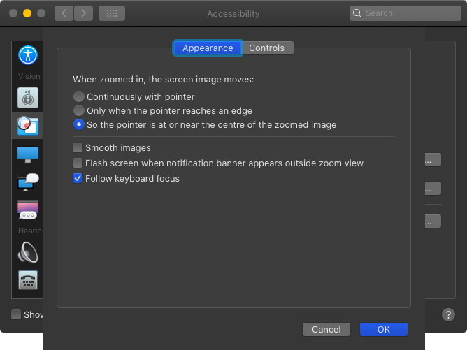

Sometimes during the development of an iOS app, you need to figure out, how many pixels are between two views.

Let's say you have an image view and a label underneath it.
In interface builder you can select the image view, press and hold the ⌥ key and hover with the mouse pointer over the label.
The interface builder shows you the distance in points between the two view like shown in the following image: 

{:refdef: style="text-align: center;"}

{:refdef}

But this is the distance between the label and the image view.
What if we need to figure out the distance between text in the label and the image.

In this case we can use a third party tool like xScope as we did in [CGAffineTransform and Auto Layout]({{ $side_url }}/cgaffinetransform-and-auto-layout/).
But even without such a tool, we can count the pixels.
Here is how.

First set the window of the simulator to Point Accurate like shown in this image:

{:refdef: style="text-align: center;"}

{:refdef}

Next open the Accessibility settings of your Mac and select Zoom in the menu on the left.
Check the check box at 'Use scroll gesture with modifier keys to zoom' and select a modifier key.
I use the control key:

{:refdef: style="text-align: center;"}

{:refdef}

When you now press and hold that modifier key and perform a scroll gesture on your track pad or using the mouse, the screen zooms.
You can change the zoom style to what fits you preferences best.
But to be able to count pixels, we need to change another setting.
Click the Advanced button and uncheck the check box 'Smooth images':

{:refdef: style="text-align: center;"}

{:refdef}

Now you can zoom into the part you are interested in and count pixels.
Unfortunately I couldn't figure out how to create a screenshot with the zoom enabled.
So you need to try this yourself.

If you have any comments on that post, you can find my on Twitter as [@dasdom](https://twitter.com/dasdom).

