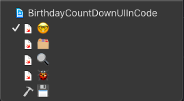
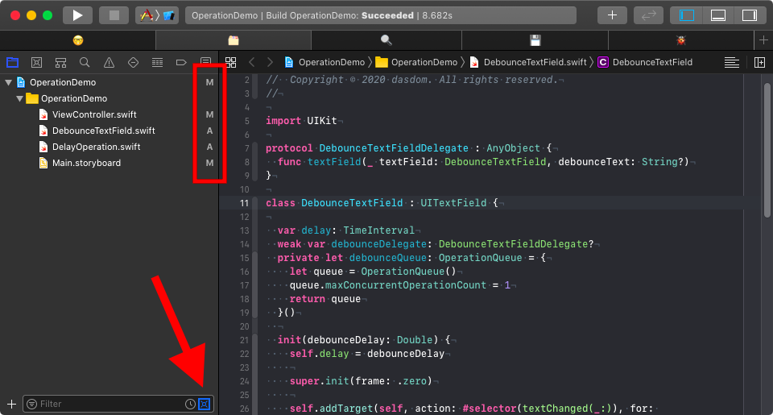

Tabs in Xcode can be quite useful.
I use them a lot.

{:refdef: style="text-align: center;"}

{:refdef}

Usually I have a tab for coding (🤓), one for the files with a source control status (🗂), a tab for searching (🔍), a tab for debugging (🐞) and one for the build (💾).

## 🤓 Coding

The coding tab shows the project navigator with all files.
Usually there is no inspector visible in the coding tab because most of the times I do my user interfaces in code.

## 🗂 Source Control Status

The source control status tab shows the project navigator with the source control status filter active.

{:refdef: style="text-align: center;"}

{:refdef}

This tab is useful when I need to figure out what I have changed since the last commit and if I need to revert a change I did while debugging.

## 🔍 Search

This tab shows the find navigator.
This tab is useful when I need to find usages of a class or a method but want to keep track of the file I working on right now in the coding tab.

## 🐞 Debug

I have set up a behavior such that Xcode switches to the debug tab when running starts.
The behavior automatically selects the debug navigator and shows the variable and console view of the debugger.
This way Xcode shows all the information I need to debug problems when they occur.

{:refdef: style="text-align: center;"}

{:refdef}

## 💾 Build

The build tab used to show the log of the build.
I have a behavior that show the build log when the build starts.
Unfortunately Apple broke that behavior with Xcode 10 and still haven't fixed it (FB7675730).
As long as the behavior is broken, this tab shows the report navigator and I can select the build log myself if I need to.

{:refdef: style="text-align: center;"}

{:refdef}

## Bookmarks

In addition to that I also use tabs when I navigate through code I don't know or understand to keep track of important classes.
So in a way I sometimes use tabs as bookmarks.

Do you use tabs?
Why not?
Do you have other comments on this post?
Let me know on Twitter: [@dasdom](https://twitter.com/dasdom).

